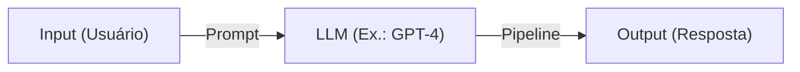

# **Item 2: Introdução ao LangChain**

## **O que é o LangChain?**

LangChain é uma biblioteca projetada para criar pipelines robustos que integram **Modelos de Linguagem de Grande Escala (LLMs)** com diversas ferramentas e fontes de dados. Seu propósito é facilitar a construção de aplicativos de IA baseados em LLMs, oferecendo abstrações modulares e flexíveis que permitem a criação de fluxos complexos e contextualmente ricos.

---

### **Casos de Uso Principais do LangChain**

1. **Geração de Texto Avançada**  
   Personalizar a saída de LLMs para tarefas como redação, storytelling e produção de conteúdo.
   
2. **Perguntas e Respostas com Contexto (RAG)**  
   Combinar LLMs com bases de dados externas para responder a perguntas específicas usando informações relevantes.

3. **Chatbots Personalizados**  
   Criar bots com personalidade, utilizando prompts dinâmicos e informações personalizadas.

4. **Análise e Processamento de Documentos**  
   Processar documentos extensos em busca de insights, resumos ou respostas para perguntas específicas.

5. **Execução de Ações com LLMs**  
   Usar LLMs para tomar decisões com base em dados, gerenciar fluxos de trabalho e interagir com APIs externas.

---

### **Propósito Geral da Biblioteca**

O LangChain se concentra em dois objetivos principais:  
1. **Conexão com Dados**: Permite que LLMs utilizem dados externos, como arquivos locais, APIs ou bancos de dados, integrando pipelines com ferramentas como FAISS, Pinecone ou HuggingFace.  
2. **Execução de Tarefas Complexas**: Cria pipelines de execução que coordenam fluxos de trabalho envolvendo várias etapas, como processamento de entradas, execução de LLMs, e integração com ferramentas externas.

---

### **Instalação e Configuração do LangChain**

#### **1. Requisitos**

- **Python 3.8 ou superior**  
- Ambiente virtual recomendado (usando `venv` ou `conda`).

#### **2. Instalação**

Use o seguinte comando para instalar o LangChain e suas dependências básicas:  

```bash
pip install langchain openai
```

Se você pretende usar integrações específicas, como FAISS ou Pinecone:  

```bash
pip install langchain[faiss]
pip install pinecone-client
```

---

### **Exemplo Prático: Configurando um Pipeline Básico**

#### **Pipeline de Geração de Texto**

O exemplo abaixo utiliza o OpenAI GPT como LLM e mostra como criar um pipeline básico para geração de texto.

```python
from langchain.llms import OpenAI

# Configure sua chave de API OpenAI
import os
os.environ["OPENAI_API_KEY"] = "sua-chave-api"

# Instancie o modelo LLM (usando GPT-3.5 ou GPT-4)
llm = OpenAI(model="text-davinci-003", temperature=0.7, max_tokens=150)

# Execute uma tarefa de geração de texto
response = llm("Explique o que é o LangChain de forma simples.")
print(response)
```

#### **Pipeline de Perguntas e Respostas com Dados Locais**

Aqui, combinamos o LangChain com FAISS para buscar respostas em documentos locais.

**1. Instale as dependências adicionais:**  

```bash
pip install faiss-cpu langchain[faiss]
```

**2. Código de exemplo:**  

```python
from langchain.vectorstores import FAISS
from langchain.embeddings import OpenAIEmbeddings
from langchain.chains import RetrievalQA
from langchain.llms import OpenAI

# Configuração do LLM
llm = OpenAI(model="text-davinci-003")

# Crie embeddings e um índice local usando FAISS
documents = ["LangChain é uma biblioteca incrível para trabalhar com LLMs.",
             "Você pode integrá-la com ferramentas como FAISS e Pinecone."]
embeddings = OpenAIEmbeddings()
db = FAISS.from_texts(documents, embeddings)

# Configure o pipeline de perguntas e respostas
retriever = db.as_retriever()
qa = RetrievalQA(llm=llm, retriever=retriever)

# Faça uma pergunta com base nos documentos
question = "O que é o LangChain?"
answer = qa.run(question)
print(answer)
```

---

### **Estrutura Básica do LangChain**

O LangChain é organizado em módulos que facilitam a construção de pipelines personalizados. Alguns dos principais módulos incluem:

1. **LLMs**: Configuração dos modelos de linguagem.  
2. **Prompts**: Gerenciamento de prompts dinâmicos.  
3. **Chains**: Encadeamento de etapas de execução.  
4. **Memory**: Memória para chatbots e interações persistentes.  
5. **Document Loaders**: Carregamento e processamento de dados de fontes externas.  
6. **Vector Stores**: Busca semântica em dados indexados.  

#### **Diagrama Simplificado de Pipeline**  



