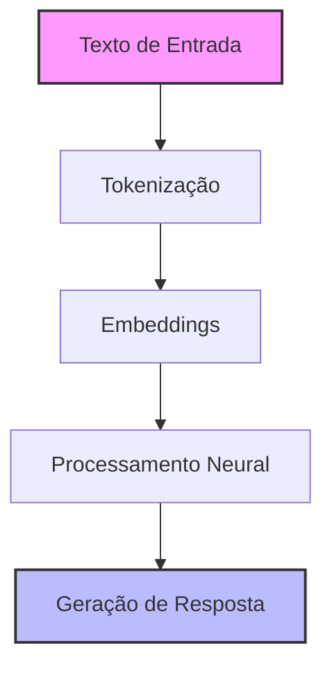
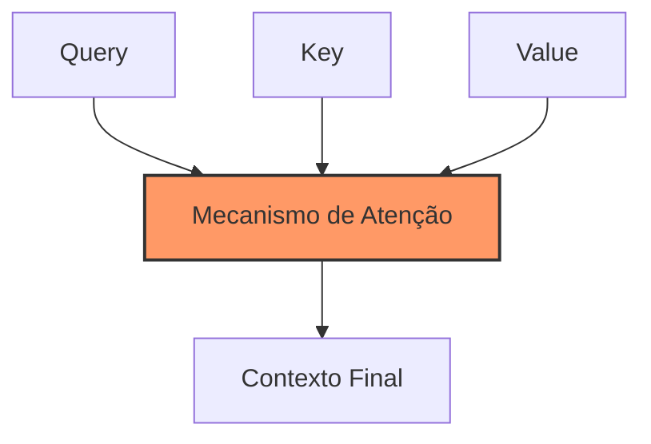

# Capítulo 1 - Fundamentos de LLMs

## Introdução

Bem-vindo ao fascinante mundo dos Grandes Modelos de Linguagem (Large Language Models - LLMs)! Se você já se perguntou como chatbots conseguem manter conversas tão naturais ou como sistemas de IA podem gerar textos coerentes, você está prestes a descobrir. Neste primeiro capítulo, vamos desvendar os fundamentos essenciais dos LLMs, construindo uma base sólida para que você possa, mais adiante, criar suas próprias aplicações inteligentes.

## O que são LLMs?

Imagine um sistema que passou anos "lendo" praticamente toda a internet, livros e documentos disponíveis digitalmente. Agora imagine que este sistema aprendeu não apenas palavras isoladas, mas padrões complexos de linguagem, contextos e até nuances culturais. Isso é um LLM - um modelo de inteligência artificial especializado em compreender e gerar linguagem natural.

Os LLMs são "grandes" em dois aspectos fundamentais. Primeiro, em termos de tamanho computacional - eles podem ter desde milhões até trilhões de parâmetros ajustáveis, algo como os "neurônios" do modelo. Segundo, em termos de capacidades - eles podem realizar uma ampla gama de tarefas linguísticas, desde completar frases até gerar código ou criar histórias completas.

## Como os LLMs Funcionam?

Para entender como um LLM funciona, vamos seguir a jornada de uma frase desde o momento em que ela entra no modelo até quando obtemos uma resposta.

### O Processo de Tokenização

Tudo começa com a tokenização. Pense nela como o processo de "tradução" do nosso texto para uma linguagem que o computador possa processar eficientemente. É como quebrar um texto em pequenos pedaços significativos.

No passado, os sistemas simplesmente dividiam o texto em palavras. Porém, isso criava problemas com palavras raras ou em diferentes idiomas. Por exemplo, a palavra "infelizmente" poderia ser uma palavra rara em um sistema baseado em palavras completas.

Os sistemas modernos usam uma abordagem mais inteligente chamada tokenização por subpalavras. É como se o sistema aprendesse automaticamente as partes mais comuns das palavras. Assim, "infelizmente" poderia ser dividido em "in", "feliz" e "mente" - todas partes comuns que o modelo já conhece bem.

### Embeddings: A Matemática por Trás do Significado

Após a tokenização, cada token é convertido em um vetor matemático - seu embedding. Pense nos embeddings como coordenadas em um espaço multidimensional onde palavras com significados semelhantes ficam próximas umas das outras.



## A Arquitetura Transformer

O coração de um LLM moderno é a arquitetura Transformer. Vamos entender como ela funciona usando uma analogia.

Imagine uma sala de aula onde cada aluno (token) pode prestar atenção em todos os outros alunos simultaneamente. Cada aluno tem um caderno (vetor) onde anota informações sobre os outros alunos, dando mais importância para as anotações mais relevantes para o contexto atual. Isso é essencialmente o mecanismo de "atenção" dos Transformers.



O mecanismo de atenção permite que o modelo:
- Processe todo o texto paralelamente, em vez de palavra por palavra
- Mantenha o contexto mesmo em textos longos
- Capture relações complexas entre diferentes partes do texto

## Hardware e Recursos Computacionais

Trabalhar com LLMs exige hardware adequado. Vamos entender as necessidades práticas para diferentes cenários.

### Memória e Processamento

Um LLM consome memória de duas formas principais:

Para os parâmetros do modelo: Um modelo de 7 bilhões de parâmetros em precisão FP16 precisa de aproximadamente 14GB de VRAM apenas para ser carregado.

Para o processamento: Durante a execução, o modelo precisa de memória adicional para:
- Armazenar os estados intermediários
- Manter o contexto da conversa
- Realizar cálculos de atenção

### Requerimentos de GPU

Para trabalhar com diferentes tamanhos de modelos, você precisará de GPUs específicas:

Para modelos pequenos (até 7B parâmetros):
Uma RTX 3060 com 12GB ou RTX 4060 com 16GB será suficiente.

Para modelos médios (7B-13B parâmetros):
Considere uma RTX 3080 com 24GB ou RTX 4080 com 16GB.

Para modelos grandes (acima de 13B parâmetros):
Você precisará de GPUs profissionais como A5000 (24GB) ou A6000 (48GB).

## Otimização e Eficiência

### Quantização

A quantização é uma técnica poderosa para reduzir o uso de memória. Em vez de usar números em ponto flutuante de 32 bits (FP32) ou 16 bits (FP16), podemos usar inteiros de 8 bits (INT8) ou até 4 bits (INT4). Isso pode reduzir significativamente o uso de memória com uma pequena perda de qualidade.

### Técnicas de Otimização de Memória

Existem várias estratégias para otimizar o uso de memória:

O gradient checkpointing salva memória durante o treinamento recalculando alguns valores em vez de armazená-los.

O model offloading move partes do modelo entre CPU e GPU conforme necessário.

O modelo paralelo distribui o modelo entre múltiplas GPUs.

## Considerações Práticas

### Escolhendo o Modelo Certo

A escolha do modelo depende de vários fatores:

O hardware disponível determina o tamanho máximo do modelo que você pode usar.

Os requisitos de latência influenciam se você deve usar um modelo local ou em nuvem.

O domínio específico da sua aplicação pode sugerir modelos especializados.

### Monitoramento e Manutenção

Um sistema bem-sucedido com LLMs requer monitoramento constante:

```python
def monitor_gpu():
    import nvidia_smi
    nvidia_smi.nvmlInit()
    handle = nvidia_smi.nvmlDeviceGetHandleByIndex(0)
    info = nvidia_smi.nvmlDeviceGetMemoryInfo(handle)
    print(f"Memória Usada: {info.used / 1e9:.2f} GB")
    print(f"Memória Livre: {info.free / 1e9:.2f} GB")
```

## Próximos Passos

Agora que você compreende os fundamentos dos LLMs, está preparado para explorar frameworks como o LangChain, que veremos no próximo capítulo. O LangChain nos ajudará a construir aplicações práticas aproveitando todo o poder dos LLMs que acabamos de estudar.

## Recursos Adicionais

Para aprofundar seus conhecimentos, recomendo explorar:

A documentação oficial do Hugging Face Transformers
O paper original do Transformer: "Attention is All You Need"
O GitHub do projeto LLaMA para entender modelos open-source
Os fóruns da comunidade PyTorch para discussões técnicas

Lembre-se: a jornada para dominar LLMs é um processo contínuo de aprendizado. No próximo capítulo, vamos ver como podemos aplicar esses conhecimentos na prática usando o LangChain.
