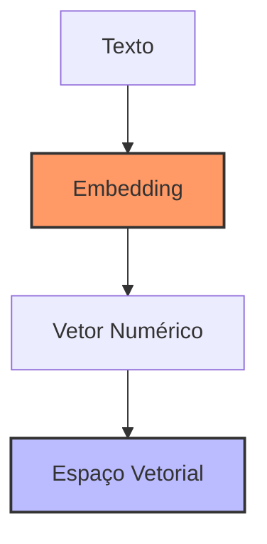

# Capítulo 11 - Embeddings e Vetorização

## Introdução aos Embeddings

Se você já se perguntou como computadores conseguem "entender" texto ou como é possível buscar documentos similares sem fazer uma comparação palavra por palavra, você está prestes a descobrir. Embeddings são a tecnologia fundamental que permite transformar texto em números que computadores podem processar eficientemente, mantendo o significado semântico original.

## O que são Embeddings?

Imagine que você precisa explicar para um computador o que significa a palavra "boi". Como fazemos isso? Os embeddings são como um mapa que posiciona cada palavra ou texto em um espaço multidimensional, onde textos com significados semelhantes ficam próximos uns dos outros.



Por exemplo, em um espaço vetorial bem treinado:
- "boi" e "vaca" estariam próximos
- "pastagem" e "capim" também estariam próximos
- mas "boi" e "computador" estariam distantes

## Modelos de Embedding

Existem diversos modelos disponíveis, cada um com suas características:

### OpenAI Embeddings

```python
from langchain.embeddings import OpenAIEmbeddings

embeddings = OpenAIEmbeddings()

# Gerando embedding para um texto
texto = "O boi Nelore é adaptado ao clima tropical"
embedding = embeddings.embed_query(texto)

# O resultado é um vetor de 1536 dimensões
print(f"Dimensões do embedding: {len(embedding)}")
```

### Modelos Sentence Transformers

```python
from langchain.embeddings import HuggingFaceEmbeddings

# Usando um modelo multilíngue
model_name = "sentence-transformers/multilingual-MiniLM-L12-v2"
embeddings = HuggingFaceEmbeddings(model_name=model_name)

# Gerando embeddings em português
texto_pt = "Manejo sanitário do rebanho"
embedding_pt = embeddings.embed_query(texto_pt)
```

## Técnicas de Vetorização

### Processamento de Texto

Antes de gerar embeddings, é importante preparar o texto:

```python
import re
from typing import List

def preprocessar_texto(texto: str) -> str:
    """
    Prepara o texto para vetorização
    """
    # Converter para minúsculas
    texto = texto.lower()
    
    # Remover caracteres especiais
    texto = re.sub(r'[^\w\s]', '', texto)
    
    # Remover espaços extras
    texto = re.sub(r'\s+', ' ', texto).strip()
    
    return texto

def vetorizar_documentos(documentos: List[str], embeddings) -> List[List[float]]:
    """
    Vetoriza uma lista de documentos
    """
    # Preprocessamento
    docs_prep = [preprocessar_texto(doc) for doc in documentos]
    
    # Vetorização em lote
    return embeddings.embed_documents(docs_prep)
```

### Otimização de Performance

Para melhorar a performance da vetorização:

```python
from concurrent.futures import ThreadPoolExecutor
from typing import List, Callable
import numpy as np

class VetorizadorOtimizado:
    def __init__(self, embedding_function: Callable, batch_size: int = 32):
        self.embedding_function = embedding_function
        self.batch_size = batch_size
        
    def vetorizar_em_lotes(self, textos: List[str]) -> np.ndarray:
        """
        Vetoriza textos em lotes paralelos
        """
        # Divide em lotes
        batches = [
            textos[i:i + self.batch_size] 
            for i in range(0, len(textos), self.batch_size)
        ]
        
        # Processa em paralelo
        with ThreadPoolExecutor() as executor:
            embeddings_lotes = list(executor.map(
                self.embedding_function.embed_documents, 
                batches
            ))
        
        # Combina resultados
        return np.vstack(embeddings_lotes)
```

## Armazenamento e Recuperação

### Formato de Armazenamento

```python
import numpy as np
import json

class EmbeddingStorage:
    def __init__(self, dimensao: int):
        self.dimensao = dimensao
        self.embeddings = []
        self.metadados = []
        
    def adicionar(self, embedding: List[float], metadado: dict):
        """
        Adiciona um embedding com seus metadados
        """
        if len(embedding) != self.dimensao:
            raise ValueError(f"Embedding deve ter {self.dimensao} dimensões")
            
        self.embeddings.append(embedding)
        self.metadados.append(metadado)
        
    def salvar(self, arquivo: str):
        """
        Salva embeddings e metadados em formato otimizado
        """
        dados = {
            "embeddings": np.array(self.embeddings).tolist(),
            "metadados": self.metadados,
            "dimensao": self.dimensao
        }
        
        with open(arquivo, 'w') as f:
            json.dump(dados, f)
```

## Similaridade e Busca

### Cálculo de Similaridade

```python
from sklearn.metrics.pairwise import cosine_similarity
import numpy as np

def calcular_similaridade(
    embedding_query: List[float], 
    embedding_doc: List[float]
) -> float:
    """
    Calcula similaridade do cosseno entre dois embeddings
    """
    # Reshaping para matriz 2D
    v1 = np.array(embedding_query).reshape(1, -1)
    v2 = np.array(embedding_doc).reshape(1, -1)
    
    return cosine_similarity(v1, v2)[0][0]
```

### Busca Eficiente

```python
import heapq
from typing import List, Tuple

class BuscadorSemantico:
    def __init__(self, embeddings: List[List[float]], textos: List[str]):
        self.embeddings = np.array(embeddings)
        self.textos = textos
        
    def buscar_top_k(
        self, 
        query: str, 
        k: int = 5
    ) -> List[Tuple[str, float]]:
        """
        Encontra os k textos mais similares à query
        """
        # Gera embedding da query
        query_emb = embeddings.embed_query(query)
        
        # Calcula similaridades
        similaridades = cosine_similarity(
            [query_emb], 
            self.embeddings
        )[0]
        
        # Encontra top-k
        top_k_idx = heapq.nlargest(
            k, 
            range(len(similaridades)), 
            key=lambda i: similaridades[i]
        )
        
        return [
            (self.textos[i], similaridades[i]) 
            for i in top_k_idx
        ]
```

## Considerações de Hardware

### GPU vs CPU

Para diferentes cargas de trabalho:

**CPU**:
- Processamento em lote pequeno (<1000 documentos)
- Modelos leves (dimensões < 384)
- Baixa latência necessária

**GPU**:
- Grandes volumes de documentos
- Modelos pesados (dimensões > 768)
- Alta throughput necessário

### Requisitos de Memória

```python
def calcular_requisitos_memoria(
    num_docs: int, 
    dim_embedding: int, 
    bits_precisao: int = 32
) -> float:
    """
    Calcula requisitos de memória em GB
    """
    bytes_per_number = bits_precisao / 8
    total_bytes = num_docs * dim_embedding * bytes_per_number
    
    return total_bytes / (1024 ** 3)  # Converte para GB

# Exemplo de uso
docs = 1_000_000  # 1 milhão de documentos
dim = 1536        # Dimensão OpenAI
mem_gb = calcular_requisitos_memoria(docs, dim)
print(f"Memória necessária: {mem_gb:.2f} GB")
```

## Otimização de Embeddings

### Redução de Dimensionalidade

```python
from sklearn.decomposition import PCA

def reduzir_dimensoes(
    embeddings: np.ndarray, 
    dim_target: int = 256
) -> np.ndarray:
    """
    Reduz dimensionalidade dos embeddings
    """
    pca = PCA(n_components=dim_target)
    return pca.fit_transform(embeddings)
```

### Quantização

```python
def quantizar_embeddings(
    embeddings: np.ndarray, 
    bits: int = 8
) -> np.ndarray:
    """
    Quantiza embeddings para reduzir uso de memória
    """
    # Encontra valores min/max
    min_val = embeddings.min()
    max_val = embeddings.max()
    
    # Quantiza para o número de bits especificado
    scale = (2**bits - 1) / (max_val - min_val)
    quantized = np.round((embeddings - min_val) * scale)
    
    return quantized.astype(np.uint8)
```

## Próximos Passos

No próximo capítulo, vamos explorar bancos de dados vetoriais, que são fundamentais para armazenar e buscar embeddings de forma eficiente em produção.

## Recursos Adicionais

Documentação OpenAI Embeddings
: https://platform.openai.com/docs/guides/embeddings

Sentence Transformers Documentation
: https://www.sbert.net/docs/quickstart.html

Guide to Text Embeddings
: https://huggingface.co/blog/getting-started-with-embeddings

Efficient Vector Search Guide
: https://www.pinecone.io/learn/vector-similarity/

Performance Optimization Tips
: https://python.langchain.com/docs/guides/embeddings/caching_embeddings