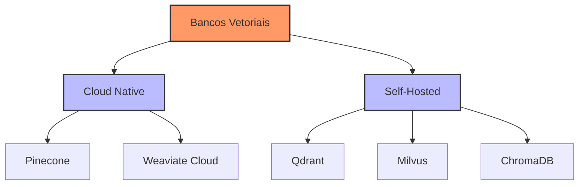

# Capítulo 12 - Bancos de Dados Vetoriais

## Introdução aos Bancos de Dados Vetoriais

No capítulo anterior, aprendemos sobre embeddings e sua importância fundamental para sistemas RAG. Agora, vamos resolver um desafio crucial: como armazenar e recuperar eficientemente milhões desses vetores? É aí que entram os bancos de dados vetoriais.

## Por que Bancos de Dados Vetoriais?

Imagine que você está construindo um sistema para processar milhares de artigos científicos. Um banco de dados tradicional como PostgreSQL até poderia armazenar os vetores, mas realizar buscas por similaridade seria extremamente ineficiente. Bancos de dados vetoriais são especializados neste tipo de operação.

## Comparação de Soluções

### Principais Players



Vamos analisar cada solução em detalhes:

#### Pinecone
- **Vantagens**: Escalabilidade automática, alta disponibilidade, fácil integração
- **Desvantagens**: Custo elevado, dados fora do Brasil
- **Ideal para**: Empresas que precisam de solução serverless robusta

#### Qdrant
- **Vantagens**: Open-source, excelente performance, controle total
- **Desvantagens**: Requer gestão de infraestrutura
- **Ideal para**: Projetos que exigem dados on-premise

#### ChromaDB
- **Vantagens**: Fácil de começar, leve, ótimo para desenvolvimento
- **Desvantagens**: Menos robusto para produção
- **Ideal para**: Prototipagem e projetos menores

## Implementação Prática

### ChromaDB para Desenvolvimento

```python
import chromadb
from chromadb.config import Settings

class VectorStoreManager:
    def __init__(self, persist_directory: str = "./chroma_db"):
        self.client = chromadb.Client(Settings(
            persist_directory=persist_directory,
            anonymized_telemetry=False
        ))
        
    def criar_colecao(self, nome: str):
        """Cria uma nova coleção de vetores"""
        return self.client.create_collection(
            name=nome,
            metadata={"hnsw:space": "cosine"}  # Métrica de similaridade
        )
        
    def adicionar_documentos(self, colecao, documentos, embeddings, metadados=None):
        """Adiciona documentos e seus embeddings à coleção"""
        if metadados is None:
            metadados = [{}] * len(documentos)
            
        colecao.add(
            documents=documentos,
            embeddings=embeddings,
            metadatas=metadados,
            ids=[f"doc_{i}" for i in range(len(documentos))]
        )
        
    def buscar_similares(self, colecao, query_embedding, n_resultados=5):
        """Busca documentos similares baseado no embedding da query"""
        return colecao.query(
            query_embeddings=[query_embedding],
            n_results=n_resultados
        )
```

### Qdrant para Produção

```python
from qdrant_client import QdrantClient
from qdrant_client.http import models

class QdrantManager:
    def __init__(self, url: str = "localhost", port: int = 6333):
        self.client = QdrantClient(url=url, port=port)
        
    def criar_colecao(self, nome: str, dimensao: int):
        """Cria uma coleção otimizada para produção"""
        self.client.create_collection(
            collection_name=nome,
            vectors_config=models.VectorParams(
                size=dimensao,
                distance=models.Distance.COSINE
            ),
            optimizers_config=models.OptimizersConfigDiff(
                indexing_threshold=20000,  # Otimizado para grandes volumes
                memmap_threshold=50000
            )
        )
        
    def adicionar_documentos(self, colecao: str, documentos, embeddings, metadados=None):
        """Adiciona documentos em batch com retry automático"""
        if metadados is None:
            metadados = [{}] * len(documentos)
            
        points = [
            models.PointStruct(
                id=i,
                vector=embedding,
                payload={
                    "text": doc,
                    **meta
                }
            )
            for i, (doc, embedding, meta) in enumerate(
                zip(documentos, embeddings, metadados)
            )
        ]
        
        self.client.upsert(
            collection_name=colecao,
            points=points,
            batch_size=100  # Otimizado para performance
        )
```

## Otimização de Consultas

### Estratégias de Indexação

```python
def configurar_indices(colecao: str, client: QdrantClient):
    """Configura índices otimizados para diferentes tipos de consulta"""
    client.create_payload_index(
        collection_name=colecao,
        field_name="area_pesquisa",
        field_schema=models.PayloadSchemaType.KEYWORD
    )
    
    client.create_payload_index(
        collection_name=colecao,
        field_name="data_publicacao",
        field_schema=models.PayloadSchemaType.DATETIME
    )
```

### Consultas Híbridas

```python
def busca_hibrida(
    client: QdrantClient,
    colecao: str,
    query_embedding: list,
    filtros: dict,
    limite: int = 10
):
    """
    Realiza busca combinando similaridade vetorial e filtros tradicionais
    """
    return client.search(
        collection_name=colecao,
        query_vector=query_embedding,
        query_filter=models.Filter(
            must=[
                models.FieldCondition(
                    key=key,
                    match=models.MatchValue(value=value)
                )
                for key, value in filtros.items()
            ]
        ),
        limit=limite
    )
```

## Considerações de Hardware

### Requisitos por Escala

Para diferentes volumes de dados:

**Pequeno (até 1M vetores)**:
- CPU: 4 cores
- RAM: 16GB
- SSD: 100GB
- Exemplo: Máquina t3.xlarge na AWS

**Médio (1M-10M vetores)**:
- CPU: 8+ cores
- RAM: 32GB
- SSD NVMe: 500GB
- Exemplo: r5.2xlarge na AWS

**Grande (10M+ vetores)**:
- CPU: 16+ cores
- RAM: 64GB+
- SSD NVMe em RAID 0: 1TB+
- Exemplo: r5.4xlarge na AWS

### Otimização de Hardware

```python
def calcular_recursos_necessarios(
    num_vetores: int,
    dim_vetores: int,
    bits_quantizacao: int = 8
) -> dict:
    """
    Calcula recursos necessários para uma instalação
    """
    # Tamanho base por vetor
    bytes_por_vetor = (dim_vetores * bits_quantizacao) / 8
    
    # Espaço para vetores
    espaco_vetores = (num_vetores * bytes_por_vetor) / (1024 ** 3)  # GB
    
    # Espaço para índices (aproximado)
    espaco_indices = espaco_vetores * 0.5
    
    # RAM recomendada (heurística)
    ram_recomendada = max(16, espaco_vetores * 0.7)
    
    return {
        "espaco_total_gb": espaco_vetores + espaco_indices,
        "ram_minima_gb": ram_recomendada,
        "cpu_cores": max(4, int(num_vetores / 1_000_000) * 2)
    }
```

## Monitoramento e Manutenção

### Métricas Críticas

```python
import psutil
import time
from typing import Dict, Any

class VectorDBMonitor:
    def __init__(self, client: Any):
        self.client = client
        self.metricas = {}
        
    def coletar_metricas(self) -> Dict[str, float]:
        """
        Coleta métricas importantes do banco vetorial
        """
        # Métricas do sistema
        cpu_percent = psutil.cpu_percent(interval=1)
        mem = psutil.virtual_memory()
        
        # Métricas específicas do banco
        colecoes = self.client.get_collections()
        total_vetores = sum(
            col.vectors_count 
            for col in colecoes
        )
        
        self.metricas = {
            "cpu_uso": cpu_percent,
            "memoria_uso": mem.percent,
            "total_vetores": total_vetores,
            "timestamp": time.time()
        }
        
        return self.metricas
```

## Próximos Passos

No próximo capítulo, exploraremos o Ollama, uma ferramenta poderosa para executar modelos de linguagem localmente, que pode ser integrada com os bancos vetoriais que aprendemos aqui.

## Recursos Adicionais

Documentação Qdrant
: https://qdrant.tech/documentation/

ChromaDB Quickstart
: https://docs.trychroma.com/getting-started

Guia de Otimização Qdrant
: https://qdrant.tech/documentation/tutorials/optimization

Fórum da Comunidade Vectors
: https://discuss.vector-database.com/

Milvus Bootcamp
: https://milvus.io/bootcamp