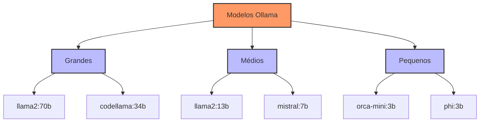

# Capítulo 13 - Modelos Locais com Ollama

## Introdução ao Ollama

Em todos os capítulos anteriores, trabalhamos principalmente com modelos de linguagem hospedados em nuvem, como o GPT-4 da OpenAI. Agora, vamos explorar uma alternativa poderosa: rodar modelos localmente usando o Ollama. Esta abordagem é especialmente relevante quando precisamos de maior controle sobre nossos dados, menor latência ou quando queremos reduzir custos operacionais.

## Por que Usar Modelos Locais?

Existem várias razões convincentes para considerar o uso de modelos locais:

1. **Privacidade e Segurança**: Dados sensíveis nunca saem do seu ambiente
2. **Custos**: Sem custos por token ou chamada de API
3. **Latência**: Respostas mais rápidas por eliminar a latência de rede
4. **Disponibilidade**: Funciona mesmo sem conexão com internet
5. **Customização**: Maior controle sobre o modelo e seus parâmetros

## Instalação e Configuração do Ollama

### Instalação

No Linux, a instalação é simples:

```bash
curl https://ollama.ai/install.sh | sh
```

Para outros sistemas operacionais, você pode baixar o instalador direto do site oficial do Ollama.

### Configuração Inicial

```bash
# Iniciar o serviço Ollama
systemctl --user start ollama

# Verificar status
systemctl --user status ollama

# Baixar um modelo (exemplo: Llama 2)
ollama pull llama2
```

## Modelos Disponíveis

O Ollama oferece acesso a diversos modelos otimizados:



### Comparação de Modelos

| Modelo | Tamanho | VRAM Necessária | Use Case Ideal |
|--------|---------|-----------------|----------------|
| llama2:70b | 70B | 48GB+ | Tarefas complexas de raciocínio |
| llama2:13b | 13B | 16GB+ | Uso geral, boa relação custo-benefício |
| mistral:7b | 7B | 8GB+ | Tarefas mais simples, hardware limitado |
| orca-mini:3b | 3B | 4GB+ | Prototipagem, dispositivos com pouca memória |

## Integração com Python

Vamos ver como integrar o Ollama com Python usando a biblioteca oficial:

```python
from langchain.llms import Ollama
from langchain.callbacks.manager import CallbackManager
from langchain.callbacks.streaming_stdout import StreamingStdOutCallbackHandler

class OllamaManager:
    def __init__(self, model_name="llama2"):
        self.llm = Ollama(
            model=model_name,
            callback_manager=CallbackManager([
                StreamingStdOutCallbackHandler()
            ])
        )
    
    def gerar_resposta(self, prompt: str) -> str:
        """
        Gera uma resposta usando o modelo local
        """
        try:
            return self.llm(prompt)
        except Exception as e:
            print(f"Erro ao gerar resposta: {e}")
            return None
    
    def gerar_embeddings(self, texto: str) -> list:
        """
        Gera embeddings usando modelo local
        """
        try:
            response = self.llm.embeddings([texto])
            return response[0]
        except Exception as e:
            print(f"Erro ao gerar embeddings: {e}")
            return None
```

## Customização de Modelos

O Ollama permite customizar modelos existentes:

```bash
# Modelfile
FROM llama2

# Configurações personalizadas
PARAMETER temperature 0.7
PARAMETER top_p 0.9
PARAMETER top_k 40

# Sistema de prompt personalizado
SYSTEM """
Você é um assistente especializado em investimento de ações.
Suas respostas devem ser técnicas e precisas, focando em:
- Ganhos de dividendos
- Evitar prejuíjos
- Análise de mercado
- Análise fundamentalista
"""
```

### Treinamento Adicional

Para casos específicos, podemos fazer fine-tuning:

```python
def preparar_dados_treinamento():
    """
    Prepara dados para fine-tuning
    """
    dados = [
        {"prompt": "Melhor ação para comprar", "completion": "A melhor ação..."},
        {"prompt": "Análise fundamentalista", "completion": "A análise é feita..."}
    ]
    
    with open("dados_treino.jsonl", "w") as f:
        for item in dados:
            json.dump(item, f)
            f.write("\n")

# Comando para treinar
# ollama create custom-model -f Modelfile
```

## Gerenciamento de Recursos

### Monitoramento de Uso

```python
import psutil
import GPUtil

def monitorar_recursos():
    """
    Monitora uso de recursos durante execução
    """
    # CPU
    cpu_percent = psutil.cpu_percent(interval=1)
    
    # Memória
    mem = psutil.virtual_memory()
    
    # GPU (se disponível)
    try:
        gpus = GPUtil.getGPUs()
        gpu_uso = gpus[0].load * 100
        gpu_memoria = gpus[0].memoryUtil * 100
    except:
        gpu_uso = gpu_memoria = 0
    
    return {
        "cpu_uso": cpu_percent,
        "memoria_uso": mem.percent,
        "gpu_uso": gpu_uso,
        "gpu_memoria": gpu_memoria
    }
```

### Otimização de Performance

```python
class OllamaOptimizer:
    def __init__(self, modelo_base="llama2"):
        self.modelo = modelo_base
        
    def ajustar_parametros(self, tarefa):
        """
        Ajusta parâmetros baseado no tipo de tarefa
        """
        configs = {
            "chat": {
                "temperature": 0.7,
                "top_p": 0.9,
                "repetition_penalty": 1.1
            },
            "analise": {
                "temperature": 0.2,
                "top_p": 0.95,
                "repetition_penalty": 1.05
            },
            "criativo": {
                "temperature": 0.9,
                "top_p": 0.8,
                "repetition_penalty": 1.2
            }
        }
        
        return configs.get(tarefa, configs["chat"])
```

## Requisitos de Hardware

### Configurações Recomendadas

Para diferentes tamanhos de modelo:

**Modelos Pequenos (1-3B parâmetros)**:
- CPU: 4+ cores
- RAM: 8GB
- GPU: Opcional, 4GB VRAM
- Exemplo: GTX 1650

**Modelos Médios (7-13B parâmetros)**:
- CPU: 8+ cores
- RAM: 16GB
- GPU: 8GB+ VRAM
- Exemplo: RTX 3060 12GB

**Modelos Grandes (30B+ parâmetros)**:
- CPU: 16+ cores
- RAM: 32GB+
- GPU: 24GB+ VRAM
- Exemplo: RTX 4090 ou A5000

## Melhores Práticas

### Segurança

```python
def configurar_seguranca():
    """
    Configura práticas seguras para uso do Ollama
    """
    # Limitar acesso à rede
    firewall_rules = [
        "ufw allow from 127.0.0.1 to any port 11434",  # Porta padrão Ollama
        "ufw deny 11434"  # Bloqueia acesso externo
    ]
    
    # Configurar permissões
    os.chmod("/etc/ollama", 0o700)  # Somente dono pode acessar
    
    # Implementar rate limiting
    RATE_LIMIT = 100  # requisições por minuto
```

### Backup e Recuperação

```python
def backup_modelos():
    """
    Realiza backup dos modelos e configurações
    """
    import shutil
    from datetime import datetime
    
    timestamp = datetime.now().strftime("%Y%m%d_%H%M%S")
    backup_dir = f"backup_ollama_{timestamp}"
    
    # Backup de modelos
    shutil.copytree("/root/.ollama", backup_dir)
    
    # Backup de configurações
    shutil.copy("Modelfile", f"{backup_dir}/")
```

## Próximos Passos

No próximo capítulo, vamos explorar como integrar o Ollama com sistemas RAG para criar soluções completamente locais e personalizadas.

## Recursos Adicionais

Documentação Oficial do Ollama
: https://github.com/jmorganca/ollama/blob/main/docs/README.md

Guia de Modelos Disponíveis
: https://ollama.ai/library

Tutorial de Fine-tuning
: https://github.com/jmorganca/ollama/blob/main/docs/training.md

Fórum da Comunidade
: https://github.com/jmorganca/ollama/discussions

Guia de Otimização
: https://github.com/jmorganca/ollama/blob/main/docs/performance.md