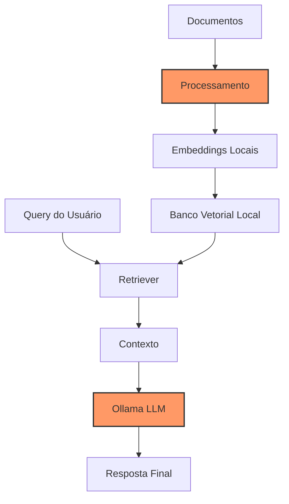

# Capítulo 14 - Integração Ollama e RAG

## Introdução

No capítulo anterior, aprendemos sobre o Ollama e como executar modelos de linguagem localmente. Agora, vamos dar um passo além: integrar o Ollama com sistemas RAG para criar uma solução completa e totalmente local. Imagine poder processar documentos confidenciais da sua fazenda sem depender de serviços em nuvem, mantendo total controle sobre seus dados.

## Por que Integrar Ollama com RAG?

A combinação de Ollama com RAG nos oferece o melhor dos dois mundos:
- Privacidade total dos dados
- Controle completo sobre o pipeline
- Custos previsíveis
- Independência de serviços externos
- Performance otimizada para seu hardware

## Arquitetura da Solução

Vamos construir um sistema RAG completo usando apenas componentes locais:



## Implementação do Sistema

### 1. Configuração Inicial

Primeiro, vamos configurar nosso ambiente com todas as dependências necessárias:

```python
from langchain.embeddings import OllamaEmbeddings
from langchain.llms import Ollama
from langchain.vectorstores import Chroma
from langchain.text_splitter import RecursiveCharacterTextSplitter
from langchain.document_loaders import DirectoryLoader
from langchain.chains import RetrievalQA
import chromadb
import os

class LocalRAGSystem:
    def __init__(
        self,
        model_name="llama2",
        embed_model="llama2",
        persist_dir="./local_db"
    ):
        self.llm = Ollama(model=model_name)
        self.embeddings = OllamaEmbeddings(model=embed_model)
        self.persist_dir = persist_dir
        self.vectorstore = None
        self.qa_chain = None
        
    def setup(self):
        """
        Configura o ambiente inicial
        """
        os.makedirs(self.persist_dir, exist_ok=True)
```

### 2. Processamento de Documentos

```python
def process_documents(self, directory_path: str):
    """
    Processa documentos de um diretório
    """
    # Carregador de documentos
    loader = DirectoryLoader(
        directory_path,
        glob="**/*.txt",  # Ajuste conforme seus tipos de arquivo
        show_progress=True
    )
    documents = loader.load()
    
    # Divisão em chunks
    text_splitter = RecursiveCharacterTextSplitter(
        chunk_size=1000,
        chunk_overlap=200,
        separators=["\n\n", "\n", ". ", "! ", "? "]
    )
    chunks = text_splitter.split_documents(documents)
    
    # Criação do banco vetorial
    self.vectorstore = Chroma.from_documents(
        documents=chunks,
        embedding=self.embeddings,
        persist_directory=self.persist_dir
    )
    self.vectorstore.persist()
```

### 3. Configuração da Chain de Recuperação

```python
def setup_qa_chain(self):
    """
    Configura a chain de pergunta e resposta
    """
    if not self.vectorstore:
        raise ValueError("Vectorstore não inicializado")
        
    self.qa_chain = RetrievalQA.from_chain_type(
        llm=self.llm,
        chain_type="stuff",
        retriever=self.vectorstore.as_retriever(
            search_kwargs={"k": 3}
        ),
        return_source_documents=True
    )
```

### 4. Sistema de Consulta

```python
def query(self, pergunta: str) -> dict:
    """
    Processa uma pergunta e retorna resposta com fontes
    """
    if not self.qa_chain:
        raise ValueError("QA Chain não configurada")
        
    resultado = self.qa_chain(pergunta)
    
    return {
        "resposta": resultado["result"],
        "documentos": [
            {
                "conteudo": doc.page_content,
                "fonte": doc.metadata.get("source", "Desconhecida")
            }
            for doc in resultado["source_documents"]
        ]
    }
```

### 5. Otimização de Performance

```python
class OptimizedLocalRAG(LocalRAGSystem):
    def __init__(self, *args, **kwargs):
        super().__init__(*args, **kwargs)
        self.cache = {}
        
    def process_documents_batch(
        self,
        directory_path: str,
        batch_size: int = 100
    ):
        """
        Processa documentos em lotes para melhor performance
        """
        documents = []
        for i, doc in enumerate(self._yield_documents(directory_path)):
            documents.append(doc)
            if len(documents) >= batch_size:
                self._process_batch(documents)
                documents = []
                
        if documents:  # Processa último lote
            self._process_batch(documents)
            
    def _process_batch(self, documents):
        """
        Processa um lote de documentos
        """
        embeddings = self.embeddings.embed_documents(
            [doc.page_content for doc in documents]
        )
        
        self.vectorstore.add_documents(
            documents=documents,
            embeddings=embeddings
        )
```

### 6. Monitoramento e Logging

```python
import logging
from datetime import datetime

class RAGMonitor:
    def __init__(self, log_file="rag_monitor.log"):
        self.logger = logging.getLogger("RAGMonitor")
        self.logger.setLevel(logging.INFO)
        
        handler = logging.FileHandler(log_file)
        handler.setFormatter(
            logging.Formatter(
                '%(asctime)s - %(levelname)s - %(message)s'
            )
        )
        self.logger.addHandler(handler)
        
    def log_query(self, query: str, response: dict, timing: float):
        """
        Registra detalhes de uma consulta
        """
        self.logger.info(
            f"Query: {query}\n"
            f"Tempo de resposta: {timing:.2f}s\n"
            f"Documentos recuperados: {len(response['documentos'])}\n"
            f"Tamanho da resposta: {len(response['resposta'])}"
        )
```

## Exemplo de Uso Prático

Vamos ver como usar nosso sistema RAG local:

```python
# Inicialização
rag = OptimizedLocalRAG(
    model_name="llama2",
    embed_model="llama2",
    persist_dir="./fazenda_db"
)

# Configuração
rag.setup()

# Processamento de documentos
rag.process_documents_batch("./documentos_fazenda")

# Configuração da chain
rag.setup_qa_chain()

# Exemplo de consulta
pergunta = """
Qual é o protocolo de vacinação recomendado para 
bezerros recém-nascidos considerando nosso histórico?
"""

resposta = rag.query(pergunta)
print(f"Resposta: {resposta['resposta']}\n")
print("Fontes consultadas:")
for doc in resposta['documentos']:
    print(f"- {doc['fonte']}")
```

## Considerações de Hardware

### Configurações Recomendadas

Para um sistema RAG local completo, considere:

**Configuração Básica (até 10k documentos)**:
- CPU: Intel i5/Ryzen 5 (6+ cores)
- RAM: 16GB
- GPU: RTX 3060 12GB
- SSD: 256GB NVMe

**Configuração Intermediária (10k-100k documentos)**:
- CPU: Intel i7/Ryzen 7 (8+ cores)
- RAM: 32GB
- GPU: RTX 3080 16GB
- SSD: 512GB NVMe

**Configuração Avançada (100k+ documentos)**:
- CPU: Intel i9/Ryzen 9 (12+ cores)
- RAM: 64GB
- GPU: RTX 4090 24GB
- SSD: 1TB NVMe em RAID 0

## Otimizações Avançadas

### Cache Inteligente

```python
from functools import lru_cache
import hashlib

class CachedLocalRAG(OptimizedLocalRAG):
    def __init__(self, *args, **kwargs):
        super().__init__(*args, **kwargs)
        
    @lru_cache(maxsize=1000)
    def _cached_query(self, query_hash: str):
        """
        Versão cacheada da consulta
        """
        return super().query(query_hash)
    
    def query(self, pergunta: str):
        """
        Implementa cache baseado no hash da pergunta
        """
        # Gera hash da pergunta
        query_hash = hashlib.md5(
            pergunta.encode()
        ).hexdigest()
        
        # Tenta recuperar do cache
        return self._cached_query(query_hash)
```

### Processamento Paralelo

```python
from concurrent.futures import ThreadPoolExecutor
import multiprocessing

def process_parallel(self, directory_path: str):
    """
    Processa documentos em paralelo
    """
    num_cores = multiprocessing.cpu_count()
    
    with ThreadPoolExecutor(max_workers=num_cores) as executor:
        futures = []
        for batch in self._get_document_batches(directory_path):
            future = executor.submit(
                self._process_batch,
                batch
            )
            futures.append(future)
            
        # Aguarda conclusão
        for future in futures:
            future.result()
```

## Melhores Práticas

1. **Segurança dos Dados**
   - Implemente criptografia em repouso para o banco vetorial
   - Controle acesso aos documentos fonte
   - Monitore uso do sistema

2. **Performance**
   - Ajuste tamanho dos chunks baseado no seu caso de uso
   - Use batching para processamento de documentos
   - Implemente cache quando apropriado

3. **Manutenção**
   - Faça backup regular do banco vetorial
   - Monitore uso de recursos
   - Mantenha logs detalhados

## Próximos Passos

No próximo capítulo, exploraremos os fundamentos do HuggingFace, que nos permitirá expandir ainda mais nossas capacidades de processamento local de linguagem natural.

## Recursos Adicionais

Documentação LangChain Ollama
: https://python.langchain.com/docs/integrations/llms/ollama

Guia ChromaDB
: https://docs.trychroma.com/

Otimização de RAG Local
: https://github.com/langchain-ai/langchain/blob/master/docs/extras/guides/local_rag_pipeline.md

Fórum da Comunidade
: https://github.com/jmorganca/ollama/discussions