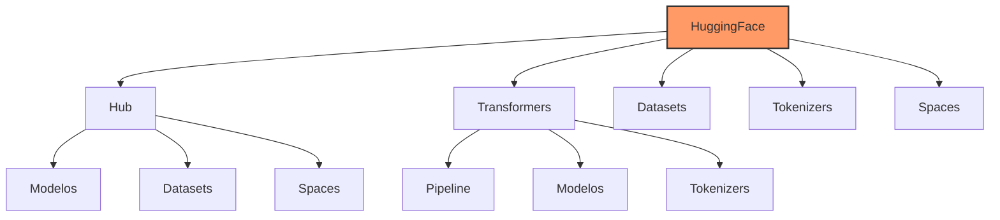

# Capítulo 15 - HuggingFace Fundamentos

## Introdução ao Ecossistema HuggingFace

Se você já trabalhou com modelos de linguagem, provavelmente se deparou com uma situação em que precisou encontrar, baixar ou usar um modelo específico. É aí que entra o HuggingFace - uma plataforma que revolucionou o acesso e uso de modelos de IA, tornando-se uma espécie de "GitHub dos modelos de linguagem".

## O que é o HuggingFace?

O HuggingFace é muito mais que um simples repositório de modelos. É um ecossistema completo que inclui:
- Hub de modelos pré-treinados
- Ferramentas para treinamento e ajuste
- Bibliotecas para processamento de linguagem natural
- Datasets para treinamento e avaliação
- Espaços (Spaces) para demonstrações

## Arquitetura do Ecossistema



## Começando com HuggingFace

### Instalação e Configuração

Primeiro, vamos configurar nosso ambiente:

```python
# Instalação das bibliotecas necessárias
!pip install transformers datasets tokenizers

# Imports fundamentais
from transformers import AutoTokenizer, AutoModel, pipeline
import torch

# Configuração de login (opcional, mas recomendado)
from huggingface_hub import login
login()  # Você precisará de um token de acesso
```

### Pipeline: A Forma Mais Simples

O pipeline é a maneira mais rápida de começar:

```python
from transformers import pipeline

# Pipeline para classificação de sentimento
classificador = pipeline(
    "sentiment-analysis",
    model="neuralmind/bert-base-portuguese-cased"
)

# Exemplo de uso
texto = "Este projeto de gestão pecuária está revolucionando nossa fazenda!"
resultado = classificador(texto)
print(f"Sentimento: {resultado[0]['label']}")
print(f"Confiança: {resultado[0]['score']:.2%}")
```

## Explorando o Hub

### Navegação e Busca

O Hub do HuggingFace é organizado por:
- Tarefas (classificação, tradução, etc.)
- Linguagens
- Licenças
- Métricas de desempenho

### Download e Uso de Modelos

```python
from transformers import AutoModelForSequenceClassification

# Carregando modelo e tokenizer
modelo = "neuralmind/bert-base-portuguese-cased"
tokenizer = AutoTokenizer.from_pretrained(modelo)
model = AutoModelForSequenceClassification.from_pretrained(modelo)

# Processamento de texto
def classificar_texto(texto: str):
    inputs = tokenizer(
        texto,
        return_tensors="pt",
        padding=True,
        truncation=True,
        max_length=512
    )
    
    outputs = model(**inputs)
    probs = outputs.logits.softmax(dim=-1)
    
    return {
        "classe": model.config.id2label[probs.argmax().item()],
        "confianca": probs.max().item()
    }
```

## Tokenizers: O Coração do Processamento

### Entendendo Tokenização

```python
from transformers import AutoTokenizer

class AnalisadorTokens:
    def __init__(self, modelo: str):
        self.tokenizer = AutoTokenizer.from_pretrained(modelo)
        
    def analisar_texto(self, texto: str):
        """
        Analisa o processo de tokenização de um texto
        """
        # Tokenização
        tokens = self.tokenizer.tokenize(texto)
        
        # IDs dos tokens
        token_ids = self.tokenizer.encode(texto)
        
        # Análise detalhada
        analise = {
            "texto_original": texto,
            "tokens": tokens,
            "num_tokens": len(tokens),
            "token_ids": token_ids,
            "tokens_especiais": [
                t for t in tokens 
                if t in self.tokenizer.all_special_tokens
            ]
        }
        
        return analise

# Exemplo de uso
analisador = AnalisadorTokens("neuralmind/bert-base-portuguese-cased")
texto = "O manejo do rebanho requer atenção especial."
analise = analisador.analisar_texto(texto)
```

## Datasets: Dados para Treinamento

### Carregando Datasets

```python
from datasets import load_dataset

# Carregando um dataset
dataset = load_dataset("csv", data_files="dados_pecuaria.csv")

# Processamento básico
def preparar_dataset(dataset):
    """
    Prepara dataset para treinamento
    """
    def tokenizar_textos(exemplos):
        return tokenizer(
            exemplos["texto"],
            padding="max_length",
            truncation=True,
            max_length=512
        )
    
    # Aplicando tokenização
    dataset_processado = dataset.map(
        tokenizar_textos,
        batched=True,
        remove_columns=dataset["train"].column_names
    )
    
    return dataset_processado
```

## Avaliação de Modelos

### Métricas de Avaliação

```python
from datasets import load_metric
import numpy as np

class AvaliadorModelo:
    def __init__(self):
        self.metricas = {
            "accuracy": load_metric("accuracy"),
            "f1": load_metric("f1")
        }
    
    def avaliar(self, predicoes, referencias):
        """
        Avalia o desempenho do modelo
        """
        resultados = {}
        
        # Calculando métricas
        for nome, metrica in self.metricas.items():
            resultado = metrica.compute(
                predictions=predicoes,
                references=referencias
            )
            resultados[nome] = resultado
            
        return resultados
```

## Considerações de Hardware

### Requisitos por Tamanho de Modelo

**Modelos Pequenos (até 500M parâmetros):**
- CPU: 4+ cores
- RAM: 8GB
- GPU: 4GB VRAM (opcional)
- Exemplo: GTX 1650

**Modelos Médios (500M-3B parâmetros):**
- CPU: 8+ cores
- RAM: 16GB
- GPU: 8GB VRAM
- Exemplo: RTX 3060

**Modelos Grandes (3B+ parâmetros):**
- CPU: 16+ cores
- RAM: 32GB+
- GPU: 16GB+ VRAM
- Exemplo: RTX 4080

## Otimização de Performance

### Aceleração com GPU

```python
class ModeloOtimizado:
    def __init__(self, nome_modelo: str):
        self.device = "cuda" if torch.cuda.is_available() else "cpu"
        self.model = AutoModel.from_pretrained(nome_modelo)
        self.model.to(self.device)
        
    def processar_lote(self, textos: List[str]):
        """
        Processa um lote de textos com otimização
        """
        # Tokenização em lote
        inputs = tokenizer(
            textos,
            padding=True,
            truncation=True,
            return_tensors="pt"
        ).to(self.device)
        
        # Processamento otimizado
        with torch.no_grad():
            outputs = self.model(**inputs)
            
        return outputs
```

### Cache e Otimização de Memória

```python
from functools import lru_cache

class ModeloCache:
    def __init__(self, modelo):
        self.modelo = modelo
        
    @lru_cache(maxsize=1000)
    def inferencia_cached(self, texto: str):
        """
        Realiza inferência com cache
        """
        return self.modelo(texto)
```

## Próximos Passos

No próximo capítulo, vamos explorar técnicas avançadas de fine-tuning usando o HuggingFace, permitindo adaptar modelos para casos de uso específicos.

## Recursos Adicionais

Documentação Oficial HuggingFace
: https://huggingface.co/docs

Guia de Modelos em Português
: https://huggingface.co/models?language=pt

Tutorial de Tokenizers
: https://huggingface.co/docs/tokenizers/

Fórum da Comunidade
: https://discuss.huggingface.co/

Course HuggingFace
: https://huggingface.co/course