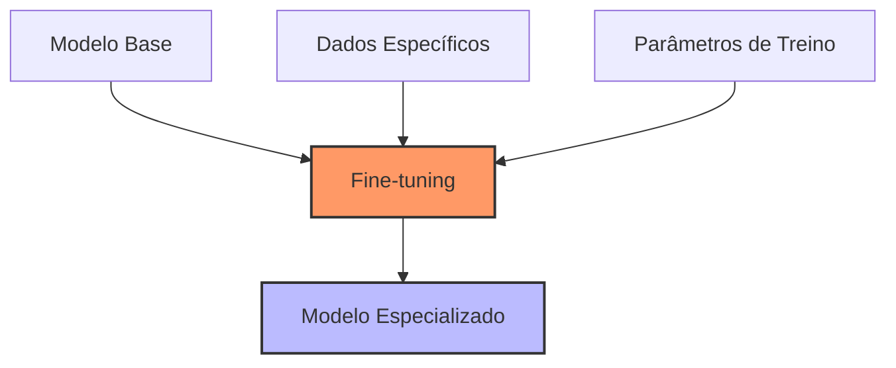

# Capítulo 16 - Fine-tuning HuggingFace

## Introdução ao Fine-tuning

No capítulo anterior, exploramos os fundamentos do HuggingFace e como usar modelos pré-treinados. Agora, vamos dar um passo além: adaptar esses modelos para tarefas específicas através do fine-tuning. Imagine que você tem um modelo que entende português, mas precisa que ele seja especialista em terminologia do agronegócio - é exatamente isso que o fine-tuning permite.

## Por que Fazer Fine-tuning?

Existem várias razões para fazer fine-tuning de um modelo:
- Adaptar para um domínio específico (ex: vocabulário técnico do agronegócio)
- Melhorar performance em tarefas específicas
- Reduzir "alucinações" do modelo em seu contexto
- Personalizar o comportamento para suas necessidades



## Preparação para Fine-tuning

### 1. Preparação do Ambiente

Primeiro, vamos configurar nosso ambiente com as ferramentas necessárias:

```python
# Instalação das bibliotecas
!pip install transformers datasets torch evaluate
!pip install accelerate -U

# Imports necessários
from transformers import (
    AutoModelForSequenceClassification,
    AutoTokenizer,
    TrainingArguments,
    Trainer
)
from datasets import load_dataset, Dataset
import torch
import pandas as pd
import numpy as np
```

### 2. Preparação dos Dados

A qualidade do fine-tuning depende diretamente da qualidade dos seus dados:

```python
class PreparadorDados:
    def __init__(self, modelo_base: str):
        self.tokenizer = AutoTokenizer.from_pretrained(modelo_base)
        
    def preparar_dataset(self, dados: pd.DataFrame):
        """
        Prepara dataset para fine-tuning
        """
        # Converte DataFrame para Dataset do HuggingFace
        dataset = Dataset.from_pandas(dados)
        
        def tokenizar_textos(exemplos):
            return self.tokenizer(
                exemplos["texto"],
                padding="max_length",
                truncation=True,
                max_length=512
            )
        
        # Tokeniza todos os textos
        dataset_processado = dataset.map(
            tokenizar_textos,
            batched=True,
            remove_columns=dataset.column_names
        )
        
        return dataset_processado

# Exemplo de uso
preparador = PreparadorDados("neuralmind/bert-base-portuguese-cased")

# Seus dados de treinamento
dados_treino = pd.DataFrame({
    "texto": [
        "O gado Nelore apresenta excelente conversão alimentar",
        "A vacinação contra aftosa é obrigatória"
    ],
    "rotulo": [1, 1]  # Exemplo de classificação binária
})

dataset_preparado = preparador.preparar_dataset(dados_treino)
```

## Processo de Fine-tuning

### 1. Configuração do Treinamento

```python
class ConfiguradorTreino:
    def __init__(
        self,
        modelo_base: str,
        output_dir: str = "./resultados_treino"
    ):
        self.modelo_base = modelo_base
        self.output_dir = output_dir
        
    def configurar_treinamento(
        self,
        batch_size: int = 8,
        num_epochs: int = 3
    ):
        """
        Configura parâmetros de treinamento
        """
        return TrainingArguments(
            output_dir=self.output_dir,
            num_train_epochs=num_epochs,
            per_device_train_batch_size=batch_size,
            per_device_eval_batch_size=batch_size,
            warmup_steps=500,
            weight_decay=0.01,
            logging_dir="./logs",
            logging_steps=10,
            evaluation_strategy="steps",
            eval_steps=500,
            save_steps=1000,
            load_best_model_at_end=True
        )

# Configuração
configurador = ConfiguradorTreino("neuralmind/bert-base-portuguese-cased")
args_treino = configurador.configurar_treinamento()
```

### 2. Implementação do Treinamento

```python
class TreinadorModelo:
    def __init__(
        self,
        modelo_base: str,
        num_labels: int,
        args_treino: TrainingArguments
    ):
        self.model = AutoModelForSequenceClassification.from_pretrained(
            modelo_base,
            num_labels=num_labels
        )
        self.args_treino = args_treino
        
    def treinar(self, dataset_treino, dataset_validacao=None):
        """
        Executa o fine-tuning do modelo
        """
        trainer = Trainer(
            model=self.model,
            args=self.args_treino,
            train_dataset=dataset_treino,
            eval_dataset=dataset_validacao
        )
        
        # Treinamento
        resultado_treino = trainer.train()
        
        # Salva modelo
        trainer.save_model()
        
        return resultado_treino, trainer

# Treinamento
treinador = TreinadorModelo(
    "neuralmind/bert-base-portuguese-cased",
    num_labels=2,
    args_treino=args_treino
)

resultado, trainer = treinador.treinar(
    dataset_preparado,
    dataset_preparado  # Usando mesmo dataset para exemplo
)
```

## Otimização e Monitoramento

### 1. Métricas de Avaliação

```python
from sklearn.metrics import classification_report
import numpy as np

class AvaliadorModelo:
    def __init__(self, modelo, tokenizer):
        self.modelo = modelo
        self.tokenizer = tokenizer
        
    def avaliar_predicoes(self, textos, labels_verdadeiros):
        """
        Avalia performance do modelo
        """
        # Tokenização
        inputs = self.tokenizer(
            textos,
            padding=True,
            truncation=True,
            return_tensors="pt"
        )
        
        # Predições
        with torch.no_grad():
            outputs = self.modelo(**inputs)
            predicoes = outputs.logits.argmax(dim=-1)
        
        # Relatório detalhado
        return classification_report(
            labels_verdadeiros,
            predicoes,
            output_dict=True
        )
```

### 2. Monitoramento de Recursos

```python
import psutil
import GPUtil
from datetime import datetime

class MonitorRecursos:
    def __init__(self, log_file="treino_recursos.log"):
        self.log_file = log_file
        
    def monitorar(self):
        """
        Monitora uso de recursos durante treino
        """
        # CPU
        cpu_percent = psutil.cpu_percent(interval=1)
        
        # Memória
        mem = psutil.virtual_memory()
        
        # GPU
        try:
            gpu = GPUtil.getGPUs()[0]
            gpu_uso = gpu.load * 100
            gpu_memoria = gpu.memoryUtil * 100
        except:
            gpu_uso = gpu_memoria = 0
        
        log_entry = (
            f"{datetime.now()} - "
            f"CPU: {cpu_percent}% - "
            f"RAM: {mem.percent}% - "
            f"GPU Uso: {gpu_uso:.1f}% - "
            f"GPU Mem: {gpu_memoria:.1f}%\n"
        )
        
        with open(self.log_file, "a") as f:
            f.write(log_entry)
```

## Técnicas Avançadas de Fine-tuning

### 1. Gradient Accumulation

Para treinar com batches maiores em GPUs com memória limitada:

```python
def configurar_gradient_accumulation(
    batch_size_desejado: int,
    batch_size_possivel: int
):
    """
    Configura acumulação de gradientes
    """
    return TrainingArguments(
        per_device_train_batch_size=batch_size_possivel,
        gradient_accumulation_steps=batch_size_desejado // batch_size_possivel,
        gradient_checkpointing=True,
        fp16=True  # Precisão mista para economia de memória
    )
```

### 2. Learning Rate Scheduling

```python
from transformers import get_scheduler

def criar_scheduler_personalizado(
    optimizer,
    num_training_steps: int,
    num_warmup_steps: int
):
    """
    Cria scheduler personalizado para learning rate
    """
    return get_scheduler(
        "cosine_with_restarts",  # Scheduler com warm restarts
        optimizer=optimizer,
        num_warmup_steps=num_warmup_steps,
        num_training_steps=num_training_steps
    )
```

## Considerações de Hardware

### Requisitos por Tamanho de Modelo

**Modelos Pequenos (até 500M parâmetros):**
- CPU: 8+ cores
- RAM: 16GB
- GPU: 8GB VRAM
- Exemplo: RTX 3060

**Modelos Médios (500M-3B parâmetros):**
- CPU: 16+ cores
- RAM: 32GB
- GPU: 16GB VRAM
- Exemplo: RTX 4080

**Modelos Grandes (3B+ parâmetros):**
- CPU: 32+ cores
- RAM: 64GB+
- GPU: 24GB+ VRAM
- Exemplo: RTX 4090 ou A5000

## Melhores Práticas

1. **Preparação de Dados**
   - Limpe e valide seus dados cuidadosamente
   - Use validação cruzada
   - Mantenha conjunto de teste separado

2. **Treinamento**
   - Comece com learning rates pequenos
   - Use early stopping
   - Monitore overfitting

3. **Avaliação**
   - Teste em dados reais
   - Avalie métricas relevantes
   - Compare com baseline

## Próximos Passos

No próximo capítulo, vamos explorar como integrar modelos fine-tuned com sistemas RAG, combinando o melhor dos dois mundos para criar soluções ainda mais poderosas.

## Recursos Adicionais

Documentação Fine-tuning Transformers
: https://huggingface.co/docs/transformers/training

Guia de Otimização de Treino
: https://huggingface.co/docs/transformers/performance

Tutorial Avançado de Fine-tuning
: https://huggingface.co/docs/transformers/training_tricks

Fórum da Comunidade
: https://discuss.huggingface.co/c/fine-tuning/16