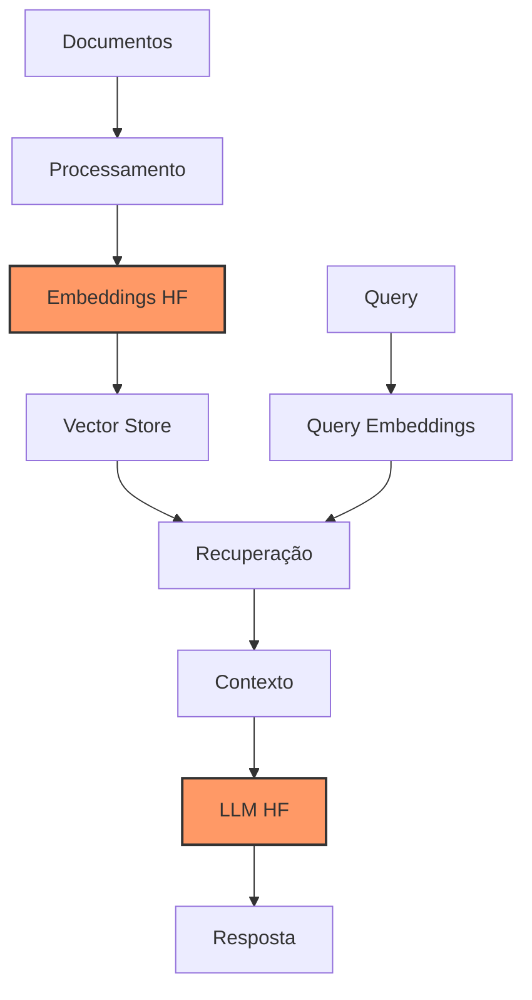

# Capítulo 17 - RAG com HuggingFace

## Introdução

Nos capítulos anteriores, exploramos os fundamentos do HuggingFace e técnicas de fine-tuning. Agora, vamos combinar esse conhecimento com RAG para criar sistemas de recuperação e geração de respostas ainda mais poderosos. A combinação de RAG com modelos do HuggingFace nos permite criar soluções totalmente personalizadas e otimizadas para nossos casos de uso específicos.

## Por que RAG com HuggingFace?

Existem várias vantagens em usar HuggingFace para implementar sistemas RAG:

1. Controle total sobre os modelos e pipeline
2. Possibilidade de usar modelos específicos para português
3. Customização completa do processo de recuperação
4. Integração com ecossistema rico de ferramentas
5. Otimização para casos de uso específicos

## Arquitetura da Solução



## Implementação Detalhada

### 1. Configuração do Ambiente

```python
from transformers import (
    AutoTokenizer,
    AutoModelForCausalLM,
    AutoModelForSequenceClassification
)
from sentence_transformers import SentenceTransformer
from langchain.vectorstores import FAISS
from langchain.text_splitter import RecursiveCharacterTextSplitter
import torch
import numpy as np

class HFRAGConfig:
    def __init__(
        self,
        llm_model="neuralmind/bert-large-portuguese-cased",
        embedding_model="neuralmind/bert-base-portuguese-cased",
        device="cuda" if torch.cuda.is_available() else "cpu"
    ):
        self.llm_model = llm_model
        self.embedding_model = embedding_model
        self.device = device
        self.chunk_size = 1000
        self.chunk_overlap = 200
        self.max_length = 512
```

### 2. Processamento de Documentos

```python
class DocumentProcessor:
    def __init__(self, config: HFRAGConfig):
        self.config = config
        self.text_splitter = RecursiveCharacterTextSplitter(
            chunk_size=config.chunk_size,
            chunk_overlap=config.chunk_overlap,
            separators=["\n\n", "\n", ".", "!", "?", ",", " "]
        )
        self.embedding_model = SentenceTransformer(
            config.embedding_model
        ).to(config.device)
        
    def process_documents(self, documents: list) -> tuple:
        """
        Processa documentos e gera embeddings
        """
        # Dividir em chunks
        chunks = self.text_splitter.create_documents(documents)
        
        # Gerar embeddings
        embeddings = self.embedding_model.encode(
            [chunk.page_content for chunk in chunks],
            show_progress_bar=True,
            batch_size=32
        )
        
        return chunks, embeddings
```

### 3. Sistema de Recuperação

```python
class HFRetriever:
    def __init__(
        self,
        config: HFRAGConfig,
        vectorstore_path: str = "./vectorstore"
    ):
        self.config = config
        self.embedding_model = SentenceTransformer(
            config.embedding_model
        ).to(config.device)
        self.vectorstore = None
        self.vectorstore_path = vectorstore_path
        
    def create_vectorstore(
        self,
        chunks: list,
        embeddings: np.ndarray
    ):
        """
        Cria e persiste o banco vetorial
        """
        self.vectorstore = FAISS(
            embeddings.shape[1],
            "cosine"
        )
        
        # Adiciona vetores ao índice
        self.vectorstore.add(
            embeddings,
            chunks
        )
        
        # Salva índice
        self.vectorstore.save_local(self.vectorstore_path)
        
    def retrieve(
        self,
        query: str,
        k: int = 4
    ) -> list:
        """
        Recupera documentos relevantes
        """
        # Gera embedding da query
        query_embedding = self.embedding_model.encode(
            [query],
            show_progress_bar=False
        )[0]
        
        # Busca documentos similares
        docs = self.vectorstore.similarity_search_by_vector(
            query_embedding,
            k=k
        )
        
        return docs
```

### 4. Geração de Respostas

```python
class HFGenerator:
    def __init__(self, config: HFRAGConfig):
        self.config = config
        self.tokenizer = AutoTokenizer.from_pretrained(config.llm_model)
        self.model = AutoModelForCausalLM.from_pretrained(
            config.llm_model
        ).to(config.device)
        
    def generate(
        self,
        query: str,
        context: list,
        max_length: int = 512
    ) -> str:
        """
        Gera resposta baseada no contexto recuperado
        """
        # Prepara prompt
        prompt = self._prepare_prompt(query, context)
        
        # Tokeniza
        inputs = self.tokenizer(
            prompt,
            return_tensors="pt",
            max_length=max_length,
            truncation=True
        ).to(self.config.device)
        
        # Gera resposta
        with torch.no_grad():
            outputs = self.model.generate(
                **inputs,
                max_length=max_length,
                num_return_sequences=1,
                no_repeat_ngram_size=3,
                do_sample=True,
                top_k=50,
                top_p=0.95,
                temperature=0.7
            )
        
        # Decodifica resposta
        response = self.tokenizer.decode(
            outputs[0],
            skip_special_tokens=True
        )
        
        return response
        
    def _prepare_prompt(
        self,
        query: str,
        context: list
    ) -> str:
        """
        Prepara prompt com query e contexto
        """
        context_text = "\n".join(
            [doc.page_content for doc in context]
        )
        
        return f"""
        Contexto:
        {context_text}
        
        Pergunta: {query}
        
        Resposta:
        """
```

### 5. Sistema RAG Completo

```python
class HFRAG:
    def __init__(
        self,
        config: HFRAGConfig = None,
        vectorstore_path: str = "./vectorstore"
    ):
        self.config = config or HFRAGConfig()
        self.processor = DocumentProcessor(self.config)
        self.retriever = HFRetriever(
            self.config,
            vectorstore_path
        )
        self.generator = HFGenerator(self.config)
        
    def index_documents(self, documents: list):
        """
        Indexa documentos no sistema
        """
        # Processa documentos
        chunks, embeddings = self.processor.process_documents(
            documents
        )
        
        # Cria índice vetorial
        self.retriever.create_vectorstore(chunks, embeddings)
        
    def query(
        self,
        query: str,
        k: int = 4
    ) -> dict:
        """
        Processa uma query completa
        """
        # Recupera documentos relevantes
        docs = self.retriever.retrieve(query, k)
        
        # Gera resposta
        response = self.generator.generate(query, docs)
        
        return {
            "resposta": response,
            "documentos": docs
        }
```

## Otimizações e Considerações

### 1. Cache Inteligente

```python
from functools import lru_cache
import hashlib

class CachedHFRAG(HFRAG):
    def __init__(self, *args, **kwargs):
        super().__init__(*args, **kwargs)
        
    @lru_cache(maxsize=1000)
    def _cached_query(self, query_hash: str):
        """
        Versão cacheada da query
        """
        return super().query(query_hash)
    
    def query(self, query: str, **kwargs):
        """
        Query com cache
        """
        # Gera hash da query
        query_hash = hashlib.md5(
            query.encode()
        ).hexdigest()
        
        return self._cached_query(query_hash)
```

### 2. Batch Processing

```python
def process_batch(
    self,
    queries: list,
    batch_size: int = 32
):
    """
    Processa múltiplas queries em batch
    """
    results = []
    
    for i in range(0, len(queries), batch_size):
        batch = queries[i:i + batch_size]
        
        # Processa batch
        batch_results = [
            self.query(q)
            for q in batch
        ]
        
        results.extend(batch_results)
    
    return results
```

## Considerações de Hardware

### Requisitos por Escala

**Pequeno (até 100k documentos)**:
- CPU: 8+ cores
- RAM: 16GB
- GPU: 8GB VRAM
- Exemplo: RTX 3060

**Médio (100k-1M documentos)**:
- CPU: 16+ cores
- RAM: 32GB
- GPU: 16GB VRAM
- Exemplo: RTX 4080

**Grande (1M+ documentos)**:
- CPU: 32+ cores
- RAM: 64GB+
- GPU: 24GB+ VRAM
- Exemplo: RTX 4090 ou A5000

## Exemplo Prático: Sistema RAG para Documentação Técnica

```python
# Configuração inicial
config = HFRAGConfig(
    llm_model="neuralmind/bert-large-portuguese-cased",
    embedding_model="neuralmind/bert-base-portuguese-cased"
)

# Inicialização do sistema
rag = HFRAG(config)

# Documentos de exemplo
documentos = [
    "O manejo correto do rebanho é fundamental...",
    "A suplementação mineral deve ser calculada...",
    "O controle sanitário preventivo..."
]

# Indexação
rag.index_documents(documentos)

# Exemplo de consulta
resultado = rag.query(
    "Qual a importância do manejo correto do rebanho?"
)

print(f"Resposta: {resultado['resposta']}")
print("\nFontes consultadas:")
for doc in resultado['documentos']:
    print(f"- {doc.page_content[:100]}...")
```

## Próximos Passos

No próximo capítulo, exploraremos técnicas de deployment e produção, aprendendo como colocar nossos sistemas RAG em ambiente produtivo de forma segura e escalável.

## Recursos Adicionais

Documentação HuggingFace Transformers
: https://huggingface.co/docs/transformers/

Guia SentenceTransformers
: https://www.sbert.net/docs/quickstart.html

Tutorial RAG com HuggingFace
: https://huggingface.co/blog/building-rag

Fórum da Comunidade
: https://discuss.huggingface.co/

Modelos em Português
: https://huggingface.co/models?language=pt