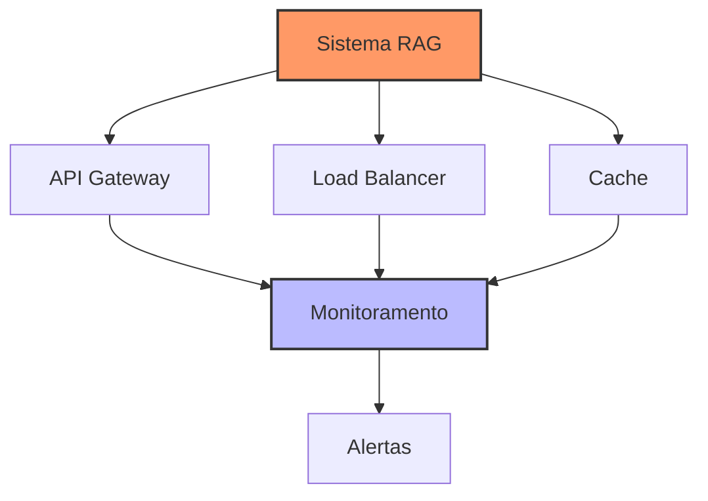

# Capítulo 18 - Deployment e Produção

## Introdução

Nos capítulos anteriores, exploramos os fundamentos do RAG, LangChain, e várias técnicas avançadas. Agora chega o momento crucial: como levar tudo isso para produção de forma robusta e confiável? Este capítulo focará nas melhores práticas de deployment, monitoramento e manutenção de sistemas RAG em ambiente produtivo.

## Arquitetura para Produção

Em um ambiente de produção, precisamos considerar vários aspectos que vão além do desenvolvimento:



### Componentes Essenciais

1. API Gateway para gerenciamento de requisições
2. Load Balancer para distribuição de carga
3. Sistema de Cache para otimização
4. Monitoramento e Alertas
5. Backup e Recuperação

## Implementação da API

Vamos implementar uma API robusta usando FastAPI:

```python
from fastapi import FastAPI, HTTPException, Depends
from fastapi.middleware.cors import CORSMiddleware
from pydantic import BaseModel
from typing import List, Optional
import uvicorn
import logging
from datetime import datetime

# Configuração de logging
logging.basicConfig(
    level=logging.INFO,
    format='%(asctime)s - %(name)s - %(levelname)s - %(message)s',
    handlers=[
        logging.FileHandler('rag_api.log'),
        logging.StreamHandler()
    ]
)

logger = logging.getLogger(__name__)

class QueryRequest(BaseModel):
    query: str
    context_filter: Optional[dict] = None
    max_results: Optional[int] = 5

class QueryResponse(BaseModel):
    answer: str
    sources: List[str]
    processing_time: float
    timestamp: str

app = FastAPI(
    title="RAG API",
    description="API para sistema RAG em produção",
    version="1.0.0"
)

# Middleware CORS
app.add_middleware(
    CORSMiddleware,
    allow_origins=["*"],
    allow_credentials=True,
    allow_methods=["*"],
    allow_headers=["*"],
)

# Middleware de logging
@app.middleware("http")
async def log_requests(request, call_next):
    start_time = datetime.now()
    response = await call_next(request)
    duration = (datetime.now() - start_time).total_seconds()
    
    logger.info(
        f"Path: {request.url.path} "
        f"Duration: {duration:.2f}s "
        f"Status: {response.status_code}"
    )
    
    return response

@app.post("/query", response_model=QueryResponse)
async def process_query(request: QueryRequest):
    try:
        start_time = datetime.now()
        
        # Processamento da query
        result = rag_system.process_query(
            request.query,
            context_filter=request.context_filter,
            max_results=request.max_results
        )
        
        duration = (datetime.now() - start_time).total_seconds()
        
        return QueryResponse(
            answer=result["answer"],
            sources=result["sources"],
            processing_time=duration,
            timestamp=datetime.now().isoformat()
        )
    
    except Exception as e:
        logger.error(f"Erro ao processar query: {str(e)}")
        raise HTTPException(
            status_code=500,
            detail=f"Erro interno: {str(e)}"
        )

if __name__ == "__main__":
    uvicorn.run(
        "main:app",
        host="0.0.0.0",
        port=8000,
        reload=False,
        workers=4
    )
```

## Sistema de Cache

A implementação de um sistema de cache eficiente é crucial para performance:

```python
from functools import lru_cache
import redis
from typing import Optional, Any
import pickle
import hashlib

class CacheSystem:
    def __init__(
        self,
        redis_host: str = "localhost",
        redis_port: int = 6379,
        ttl: int = 3600  # 1 hora
    ):
        self.redis_client = redis.Redis(
            host=redis_host,
            port=redis_port,
            decode_responses=False
        )
        self.ttl = ttl
        
    def _generate_key(self, query: str, **kwargs) -> str:
        """
        Gera chave única para cache
        """
        # Combina query e parâmetros
        cache_str = f"{query}_{str(sorted(kwargs.items()))}"
        return hashlib.md5(cache_str.encode()).hexdigest()
    
    def get(self, key: str) -> Optional[Any]:
        """
        Recupera valor do cache
        """
        try:
            value = self.redis_client.get(key)
            if value:
                return pickle.loads(value)
            return None
        except Exception as e:
            logger.error(f"Erro ao recuperar do cache: {str(e)}")
            return None
    
    def set(self, key: str, value: Any):
        """
        Armazena valor no cache
        """
        try:
            serialized_value = pickle.dumps(value)
            self.redis_client.setex(
                key,
                self.ttl,
                serialized_value
            )
        except Exception as e:
            logger.error(f"Erro ao armazenar no cache: {str(e)}")
```

## Monitoramento e Telemetria

### Sistema de Métricas

```python
from prometheus_client import Counter, Histogram, start_http_server
import time

class MetricsCollector:
    def __init__(self, port: int = 9090):
        self.query_counter = Counter(
            'rag_queries_total',
            'Total de queries processadas'
        )
        
        self.query_latency = Histogram(
            'rag_query_latency_seconds',
            'Latência de processamento de queries',
            buckets=(0.1, 0.5, 1.0, 2.0, 5.0)
        )
        
        self.error_counter = Counter(
            'rag_errors_total',
            'Total de erros',
            ['type']
        )
        
        # Inicia servidor de métricas
        start_http_server(port)
        
    def record_query(self, duration: float):
        """
        Registra métricas de uma query
        """
        self.query_counter.inc()
        self.query_latency.observe(duration)
        
    def record_error(self, error_type: str):
        """
        Registra ocorrência de erro
        """
        self.error_counter.labels(error_type).inc()
```

### Sistema de Logging Avançado

```python
import structlog
from typing import Any, Dict

class LoggerSystem:
    def __init__(self):
        self.logger = structlog.get_logger()
        
    def setup_logging(self):
        """
        Configura logging estruturado
        """
        structlog.configure(
            processors=[
                structlog.processors.TimeStamper(fmt="iso"),
                structlog.processors.StackInfoRenderer(),
                structlog.processors.format_exc_info,
                structlog.processors.JSONRenderer()
            ],
            context_class=dict,
            logger_factory=structlog.PrintLoggerFactory(),
            wrapper_class=structlog.BoundLogger,
            cache_logger_on_first_use=True,
        )
    
    def log_query(
        self,
        query: str,
        result: Dict[str, Any],
        duration: float
    ):
        """
        Registra detalhes de uma query
        """
        self.logger.info(
            "query_processed",
            query=query,
            duration=duration,
            num_sources=len(result.get("sources", [])),
            answer_length=len(result.get("answer", "")),
            timestamp=time.time()
        )
```

## Deployment com Docker

### Dockerfile

```dockerfile
# Imagem base com suporte a GPU
FROM nvidia/cuda:11.8.0-runtime-ubuntu22.04

# Variáveis de ambiente
ENV PYTHONUNBUFFERED=1
ENV DEBIAN_FRONTEND=noninteractive

# Instalação de dependências
RUN apt-get update && apt-get install -y \
    python3.9 \
    python3-pip \
    git \
    && rm -rf /var/lib/apt/lists/*

# Diretório de trabalho
WORKDIR /app

# Copia arquivos necessários
COPY requirements.txt .
COPY . .

# Instala dependências Python
RUN pip3 install --no-cache-dir -r requirements.txt

# Porta da API
EXPOSE 8000

# Comando para iniciar a aplicação
CMD ["uvicorn", "main:app", "--host", "0.0.0.0", "--port", "8000"]
```

### Docker Compose

```yaml
version: '3.8'

services:
  rag_api:
    build: .
    ports:
      - "8000:8000"
    volumes:
      - ./data:/app/data
      - ./logs:/app/logs
    environment:
      - REDIS_HOST=redis
      - MODEL_PATH=/app/models
    deploy:
      resources:
        reservations:
          devices:
            - driver: nvidia
              count: 1
              capabilities: [gpu]
    depends_on:
      - redis
      - prometheus
      
  redis:
    image: redis:6.2-alpine
    ports:
      - "6379:6379"
    volumes:
      - redis_data:/data
      
  prometheus:
    image: prom/prometheus
    ports:
      - "9090:9090"
    volumes:
      - ./prometheus.yml:/etc/prometheus/prometheus.yml
      
  grafana:
    image: grafana/grafana
    ports:
      - "3000:3000"
    volumes:
      - grafana_data:/var/lib/grafana
    depends_on:
      - prometheus

volumes:
  redis_data:
  grafana_data:
```

## Considerações de Hardware

### Requisitos por Escala

Para diferentes volumes de requisições:

**Pequeno (até 100 req/min)**:
- CPU: 8+ cores
- RAM: 32GB
- GPU: RTX 3080 16GB
- SSD: 512GB NVMe

**Médio (100-1000 req/min)**:
- CPU: 16+ cores
- RAM: 64GB
- GPU: RTX 4090 24GB
- SSD: 1TB NVMe em RAID 0

**Grande (1000+ req/min)**:
- CPU: 32+ cores
- RAM: 128GB+
- GPU: Multiple A100s
- SSD: 2TB+ NVMe em RAID 0

## Próximos Passos

No próximo capítulo, vamos explorar as melhores práticas de desenvolvimento, manutenção e segurança para sistemas RAG em produção.

## Recursos Adicionais

FastAPI Documentation
: https://fastapi.tiangolo.com/

Docker Documentation
: https://docs.docker.com/

Prometheus Documentation
: https://prometheus.io/docs/

Grafana Documentation
: https://grafana.com/docs/

NVIDIA Container Toolkit
: https://docs.nvidia.com/datacenter/cloud-native/