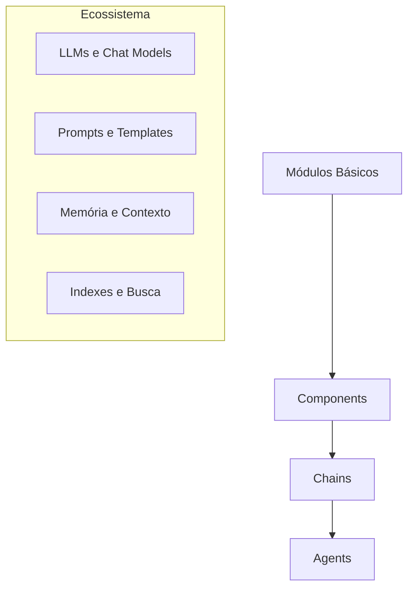
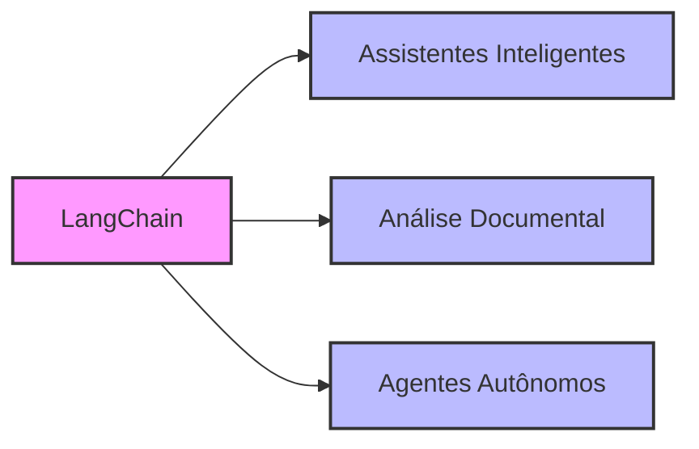

# Capítulo 2 - Introdução ao LangChain

## O que é LangChain?

Imagine que você está construindo uma casa. Você tem excelentes materiais (os LLMs que aprendemos no capítulo anterior), mas precisa de ferramentas e um plano para juntá-los de forma eficiente. O LangChain é como uma caixa de ferramentas especialmente projetada para construir aplicações com LLMs, fornecendo não apenas as ferramentas, mas também os blueprints para diferentes tipos de construções.

O LangChain é um framework que nasceu da necessidade de simplificar o desenvolvimento com LLMs. Antes dele, cada desenvolvedor precisava criar suas próprias soluções para problemas comuns, como conectar LLMs com bases de dados, manter o contexto das conversas ou permitir que modelos interagissem com ferramentas externas.

## Por que o LangChain foi criado?

O desenvolvimento de aplicações com LLMs enfrentava diversos desafios. Imagine tentar construir um assistente virtual que pudesse não apenas conversar, mas também pesquisar em documentos, fazer cálculos e tomar decisões. Sem um framework adequado, cada uma dessas funcionalidades precisaria ser desenvolvida do zero.

O LangChain resolve esses desafios oferecendo componentes reutilizáveis e padronizados. É como ter peças de LEGO® pré-fabricadas que podem ser combinadas de diferentes formas para criar aplicações complexas.

## Arquitetura do LangChain

O LangChain é organizado em camadas que trabalham juntas de forma harmoniosa. Vamos entender cada parte desta arquitetura:



### O Coração do Sistema

No centro do LangChain estão os módulos básicos que gerenciam a interação com os LLMs. Estes módulos são responsáveis pelo gerenciamento de diferentes modelos de linguagem, sejam eles locais ou em nuvem. Eles também cuidam da criação e otimização de prompts, que são as instruções dadas aos modelos. O armazenamento e recuperação do contexto das conversas também é gerenciado por estes módulos centrais, assim como a organização e busca eficiente em documentos e bases de conhecimento.

## Instalação e Primeiros Passos

Vamos começar com a instalação do LangChain. O processo é simples, mas há algumas considerações importantes:

```python
# Instalação básica
pip install langchain

# Para gerenciar variáveis de ambiente
pip install python-dotenv

# Código inicial básico
from langchain.llms import OpenAI
from dotenv import load_dotenv
import os

# Carrega configurações de ambiente
load_dotenv()

# Inicializa o LLM
llm = OpenAI(temperature=0.7)
```

### Segurança e Boas Práticas

A segurança é fundamental quando trabalhamos com LLMs. Por isso, o LangChain incentiva o uso de variáveis de ambiente para armazenar informações sensíveis como chaves de API. Crie um arquivo `.env` na raiz do seu projeto:

```plaintext
OPENAI_API_KEY=sua_chave_aqui
SERPAPI_KEY=sua_chave_aqui
```

## Casos de Uso Práticos

O LangChain brilha em diversos cenários. Vamos explorar alguns dos mais comuns:



### Assistentes Inteligentes

O LangChain permite criar assistentes que vão além de simples chat. Um assistente de atendimento ao cliente, por exemplo, pode compreender perguntas complexas, navegar por uma base de conhecimento para encontrar informações relevantes, gerar respostas personalizadas baseadas no histórico do cliente e manter um registro detalhado de todas as interações para referência futura.

### Análise Documental

O framework oferece ferramentas poderosas para processamento documental. É possível trabalhar com diversos formatos de arquivos, desde PDFs até planilhas, extraindo informações específicas conforme necessário. O sistema pode gerar resumos automáticos de documentos longos e responder a perguntas específicas sobre o conteúdo, tornando a análise de grandes volumes de documentos muito mais eficiente.

### Agentes Autônomos

Os agentes representam um dos recursos mais avançados do LangChain. Eles são como assistentes virtuais autônomos que podem tomar decisões baseadas em critérios programados, utilizar ferramentas externas quando necessário e executar sequências complexas de ações. O mais interessante é que eles podem aprender com interações anteriores, melhorando seu desempenho ao longo do tempo.

## Integração com Outras Ferramentas

O LangChain foi projetado para ser altamente extensível, integrando-se facilmente com diversas ferramentas e serviços. Vamos explorar algumas das integrações mais importantes.

### Bancos de Dados Vetoriais

O armazenamento eficiente de embeddings é crucial para muitas aplicações. O LangChain oferece suporte a várias soluções, cada uma com seus pontos fortes. O Pinecone é excelente para soluções serverless que precisam escalar. O Weaviate se destaca na busca semântica avançada. Para desenvolvimento local, o Chroma é uma escolha popular. E quando precisamos de casos de uso específicos, o FAISS da Meta oferece grande flexibilidade.

### Serviços de IA

A versatilidade do LangChain se estende aos provedores de IA. Você pode trabalhar com a OpenAI para acessar modelos como GPT-3 e GPT-4, utilizar os modelos Claude da Anthropic, explorar a variedade de modelos open source disponíveis no Hugging Face, ou integrar com as soluções de IA do Google.

## Considerações de Hardware e Infraestrutura

### Desenvolvimento Local

Para começar a desenvolver com LangChain, você precisará de um ambiente adequado. Um computador com processador moderno (preferencialmente com 4 cores ou mais) e pelo menos 16GB de RAM é recomendado. Para desenvolvimento local com modelos menores, uma GPU com 8GB de VRAM já permite experimentar muitos recursos.

### Ambiente de Produção

Em produção, as necessidades de hardware variam conforme a escala da aplicação. Para aplicações pequenas, um servidor com 32GB de RAM e uma GPU RTX 3080 ou similar pode ser suficiente. Para aplicações maiores, considere servidores com múltiplas GPUs ou mesmo clusters de servidores.

## Monitoramento e Manutenção

Um aspecto crucial do trabalho com LangChain é o monitoramento adequado do sistema. É importante acompanhar:

```python
def monitor_system():
    # Monitoramento de GPU
    import nvidia_smi
    nvidia_smi.nvmlInit()
    handle = nvidia_smi.nvmlDeviceGetHandleByIndex(0)
    info = nvidia_smi.nvmlDeviceGetMemoryInfo(handle)
    
    # Monitoramento de CPU e RAM
    import psutil
    
    print(f"GPU - Memória Usada: {info.used / 1e9:.2f} GB")
    print(f"GPU - Memória Livre: {info.free / 1e9:.2f} GB")
    print(f"CPU Usage: {psutil.cpu_percent()}%")
    print(f"RAM Usage: {psutil.virtual_memory().percent}%")
```

## Planejando sua Primeira Aplicação

Ao planejar sua primeira aplicação com LangChain, considere começar com algo simples e ir incrementando gradualmente. Um bom projeto inicial pode ser um assistente de busca em documentos. Isso permitirá que você explore recursos fundamentais como processamento de texto, embeddings e interação com LLMs.

## Próximos Passos

No próximo capítulo, vamos mergulhar nos blocos fundamentais do LangChain: LLM Wrappers, Prompt Templates e Chains. Você aprenderá como estes componentes trabalham juntos para criar aplicações poderosas e flexíveis.

Recursos Adicionais

Documentação Oficial do LangChain
: https://python.langchain.com/docs/get_started/introduction.html
Guia de Componentes LangChain
: https://python.langchain.com/docs/modules/model_io/models/
Tutorial de Chat Models
: https://python.langchain.com/docs/modules/model_io/models/chat/
Fórum da Comunidade
: https://github.com/langchain-ai/langchain/discussions
Exemplos Práticos
: https://python.langchain.com/docs/guides/deployments/example_implementations

Lembre-se: o LangChain está em constante evolução, com novas funcionalidades sendo adicionadas regularmente. Mantenha-se atualizado acompanhando o blog oficial e as discussões da comunidade.