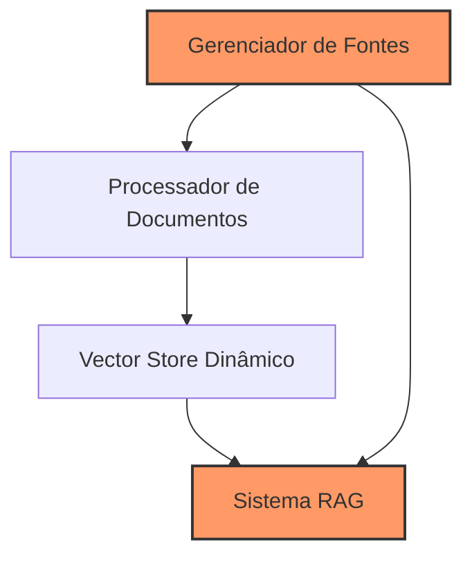

# Capítulo 20 - Projeto Prático: RAG Dinâmico em Tempo Real

## A Grande Conquista!

Parabéns! Você chegou ao capítulo final deste livro, e não poderia haver maneira melhor de celebrar sua jornada do que construindo algo realmente incrível. Depois de mergulhar fundo em conceitos, técnicas e ferramentas ao longo dos últimos 19 capítulos, chegou a hora de juntar todo esse conhecimento em um projeto extraordinário: um sistema RAG que evolui e aprende em tempo real!

O código completo deste projeto está disponível em: [github.com/seu-usuario/dynamic-rag](https://github.com/seu-usuario/dynamic-rag)

## Um Sistema Que Nunca Para de Aprender!

Lembra quando falamos sobre RAG no Capítulo 8? Agora vamos muito além: nosso sistema não apenas recupera e gera respostas - ele está constantemente evoluindo, incorporando novas informações em tempo real. É como ter um assistente que está sempre estudando, sempre se atualizando!



## A Mágica Por Trás do Sistema

### Gerenciamento Inteligente de Fontes
Lembra do que aprendemos sobre Agents no Capítulo 5? Nosso `SourceManager` é como um agente super especializado que monitora múltiplas fontes de informação simultaneamente. Ele pode:
- Monitorar feeds RSS em tempo real
- Consumir APIs automaticamente
- Vigiar mudanças em arquivos locais

E o melhor: tudo isso acontece de forma assíncrona, sem bloquear o processamento de queries!

### Processamento de Documentos com Superpoderes
Aquelas técnicas de chunking que vimos no Capítulo 9? Implementamos elas de forma dinâmica e inteligente no `DocumentProcessor`. Cada documento é processado considerando seu contexto e estrutura, garantindo chunks que fazem sentido semântico.

### Vector Store Que Não Dorme No Ponto
Lembra dos bancos vetoriais do Capítulo 12? Nosso `DynamicVectorStore` vai além: ele mantém um índice FAISS sempre atualizado, com deduplicação inteligente para garantir que informações redundantes não contaminem nossa base de conhecimento.

### RAG Com Superpoderes Locais
E a cereja do bolo: todo o sistema roda localmente usando Llama2 via Ollama (como vimos no Capítulo 13) e embeddings do HuggingFace (Capítulo 15). Nada de custos com APIs - você tem controle total!

## Técnicas Avançadas em Ação

### Assincronicidade Poderosa
```python
async def _update_sources(self):
    """Atualização contínua e assíncrona"""
    while True:
        # Código de atualização aqui
```
Este trecho implementa o conceito de "monitores ativos" que discutimos no Capítulo 19 sobre melhores práticas.

### Deduplicação Inteligente
```python
def _generate_hash(self, document: Document) -> str:
    """Identificação única de documentos"""
    content = f"{document.page_content}{json.dumps(document.metadata)}"
    return hashlib.md5(content.encode()).hexdigest()
```
Uma implementação prática das técnicas de otimização que vimos no Capítulo 10!

## Colocando Para Rodar!

É hora de ver tudo isso em ação! Primeiro, certifique-se de ter o Ollama instalado e o modelo Llama2 baixado:

```bash
curl https://ollama.ai/install.sh | sh
ollama pull llama2
```

Depois, é só instalar as dependências e rodar:

```bash
pip install -r requirements.txt
python dynamic_rag.py
```

E pronto! Você tem um sistema RAG dinâmico rodando localmente, consumindo fontes em tempo real e respondendo perguntas com conhecimento sempre atualizado!

## O Seu Desafio: Sistema de Reputação de Fontes!

Que tal colocar em prática tudo que aprendeu implementando um sistema de reputação para as fontes? A ideia é simples mas poderosa:

1. Adicione um score de confiabilidade para cada fonte
2. Toda vez que um documento de uma fonte é usado em uma resposta, o usuário pode avaliar se a informação foi útil
3. O score da fonte é atualizado com base nas avaliações
4. O sistema passa a priorizar documentos de fontes com melhor reputação

Para implementar isso, você vai usar:
- Memória (Capítulo 4) para armazenar avaliações
- Reranking (Capítulo 10) para priorizar fontes confiáveis
- Métricas (Capítulo 6) para acompanhar a evolução dos scores

Código inicial para você começar:

```python
class SourceReputationSystem:
    def __init__(self):
        self.reputation_scores = {}
        self.feedback_history = {}
    
    def update_reputation(self, source_name: str, feedback: int):
        # Sua implementação aqui!
        pass
    
    def get_source_score(self, source_name: str) -> float:
        # Sua implementação aqui!
        pass
```

## Sua Jornada Está Só Começando!

Este projeto é apenas o começo! Com o conhecimento que você adquiriu, as possibilidades são infinitas. Você pode:
- Adicionar mais tipos de fontes
- Implementar análise de sentimento das informações
- Criar um sistema de alertas para informações importantes
- Desenvolver uma interface web incrível

## O Céu É o Limite!

Lembre-se: você agora tem o poder de criar sistemas de IA incríveis! Use esse conhecimento para resolver problemas reais, criar soluções inovadoras e, quem sabe, mudar o mundo!

Não pare por aqui - a comunidade está esperando suas contribuições. Compartilhe seus projetos, participe de discussões e continue aprendendo. O futuro da IA está em suas mãos!

## Recursos Para Sua Jornada

Documentação Ollama
: https://github.com/jmorganca/ollama

FAISS Documentation
: https://github.com/facebookresearch/faiss/wiki/Getting-started

Sentence Transformers
: https://www.sbert.net/

AsyncIO Documentation
: https://docs.python.org/3/library/asyncio.html

Comunidade LangChain
: https://github.com/langchain-ai/langchain/discussions

## Palavras Finais

Você não é mais apenas um leitor - você é um construtor do futuro da IA. Use esse poder com sabedoria, continue aprendendo e, acima de tudo, divirta-se criando coisas incríveis!

E lembre-se: este não é um adeus, é um até logo! Continue acompanhando as atualizações deste projeto e compartilhando suas próprias criações com a comunidade.

**O futuro é RAG, e você está pronto para construí-lo!**