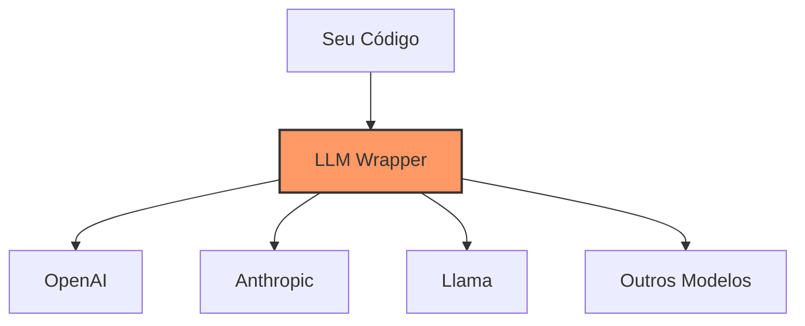
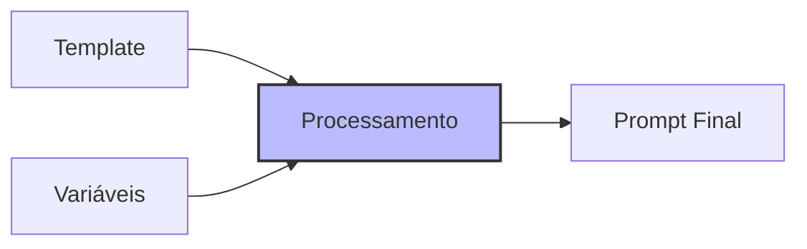
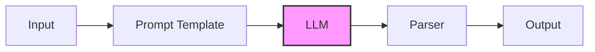

# Capítulo 3 - Blocos do LangChain

## Os Pilares da Construção

Se no capítulo anterior conhecemos o LangChain como nossa caixa de ferramentas, agora vamos desvendar as peças fundamentais que nos permitem construir aplicações incríveis. Pense nos blocos do LangChain como peças de LEGO® especializadas - cada uma tem sua função única, mas é quando as combinamos que a mágica acontece.

## LLM Wrappers: Abstraindo a Complexidade

### O que são LLM Wrappers?

Lembra quando falamos sobre diferentes modelos de linguagem no primeiro capítulo? Os LLM Wrappers são como tradutores universais que permitem que seu código converse com qualquer modelo de forma padronizada. Não importa se você está usando GPT-4, Claude, ou Llama - o wrapper se encarrega de fazer tudo funcionar harmoniosamente.



### Por que são importantes?

Imagine que você desenvolveu uma aplicação usando GPT-4, mas agora quer testar com Claude. Sem wrappers, você teria que reescrever grande parte do código. Com wrappers, é questão de mudar algumas linhas. Eles proporcionam:

- Uniformidade na interface de comunicação
- Facilidade para trocar modelos
- Gerenciamento automático de contexto e tokens
- Tratamento padronizado de erros

## Prompt Templates: A Arte de Fazer as Perguntas Certas

### Entendendo Prompt Templates

Prompt Templates são como receitas para comunicação eficaz com LLMs. Eles ajudam a estruturar suas perguntas de forma consistente e eficiente, permitindo que você insira variáveis dinamicamente.



### A Importância do Prompt Engineering

O sucesso de uma aplicação com LLMs frequentemente depende mais da qualidade dos prompts do que do modelo em si. Templates bem construídos podem:

- Melhorar significativamente a qualidade das respostas
- Reduzir alucinações do modelo
- Padronizar a comunicação em toda sua aplicação
- Economizar tokens (e consequentemente, custos)

### Exemplo Prático de Template

```python
from langchain.prompts import PromptTemplate

# Template para análise de sentimento
template = """
Analise o sentimento do seguinte texto, considerando:
- Contexto: {contexto}
- Texto: {texto}

Forneça uma análise detalhada do sentimento expresso.
"""

prompt = PromptTemplate(
    input_variables=["contexto", "texto"],
    template=template
)

# Uso do template
prompt_formatado = prompt.format(
    contexto="Avaliação de produto",
    texto="Este produto superou todas as minhas expectativas!"
)
```

## Chains: Orquestrando a Complexidade

### O Conceito de Chains

Chains são como linhas de montagem inteligentes. Elas permitem conectar diferentes componentes do LangChain em sequência, criando fluxos complexos de processamento.



### Tipos de Chains

O LangChain oferece diversos tipos de chains especializadas:

- LLMChain: A mais básica, conecta um template a um modelo
- SeriesChain: Executa múltiplas chains em sequência
- RouterChain: Direciona inputs para diferentes chains baseado em condições
- TransformChain: Modifica dados entre etapas do processamento

### Exemplo de Chain Simples

```python
from langchain.chains import LLMChain
from langchain.llms import OpenAI

# Criando uma chain básica
llm = OpenAI(temperature=0.7)
chain = LLMChain(
    llm=llm,
    prompt=prompt,  # Usando o template que criamos anteriormente
    verbose=True
)

# Executando a chain
resultado = chain.run({
    "contexto": "Avaliação de produto",
    "texto": "Este produto superou todas as minhas expectativas!"
})
```

## Considerações sobre Desempenho

### Otimização de Recursos

Ao trabalhar com os blocos do LangChain, algumas práticas podem melhorar significativamente o desempenho:

- Cache de respostas para prompts frequentes
- Otimização de templates para usar menos tokens
- Monitoramento de uso de recursos

### Batch Processing: Otimizando Requisições em Lote

O Batch Processing, ou processamento em lote, é uma técnica fundamental para otimizar o desempenho e reduzir custos ao trabalhar com LLMs. Em vez de enviar requisições uma a uma, agrupamos várias requisições para processá-las simultaneamente.

#### Por que usar Batch Processing?

O processamento em lote oferece várias vantagens:

- Redução significativa do tempo total de processamento
- Melhor utilização dos recursos computacionais
- Economia de custos em APIs que cobram por requisição
- Uso mais eficiente da largura de banda

#### Como Implementar Batch Processing no LangChain

```python
from langchain.llms import OpenAI
from typing import List

llm = OpenAI(temperature=0.7)

# Lista de textos para processar
textos = [
    "Como fazer um bolo de chocolate?",
    "Qual a receita de pão caseiro?",
    "Como preparar café coado?",
    "Como fazer omelete perfeito?"
]

# Processamento em lote
def processar_em_lote(textos: List[str], tamanho_lote: int = 5):
    """
    Processa múltiplos textos em lotes para otimizar requisições
    """
    for i in range(0, len(textos), tamanho_lote):
        lote = textos[i:i + tamanho_lote]
        # O LangChain gerencia automaticamente o processamento em lote
        resultados = llm.generate(lote)
        yield from resultados.generations

# Exemplo de uso
for resultado in processar_em_lote(textos):
    print(f"Resposta: {resultado[0].text}\n")
```

#### Considerações Importantes

Ao implementar Batch Processing, considere:

- Tamanho ideal do lote: Muito grande pode consumir muita memória, muito pequeno perde eficiência
- Timeouts e retentativas: Implemente tratamento de erros robusto
- Limites da API: Respeite os limites de requisições do provedor
- Memória disponível: Monitore o uso de memória ao processar lotes grandes

### Uso de GPU

Para processamento local de modelos, o uso adequado de GPU pode fazer uma grande diferença:

- Modelos pequenos podem rodar bem em GPUs consumer como RTX 3060
- Para chains complexas, considere GPUs com mais VRAM
- Batch processing pode otimizar o uso da GPU

## Próximos Passos

Agora que você compreende os blocos fundamentais do LangChain, no próximo capítulo exploraremos como adicionar memória aos nossos sistemas, permitindo que eles mantenham contexto ao longo de conversas e interações.

## Recursos Adicionais

Para aprofundar seus conhecimentos:

- Documentação oficial do LangChain sobre Components: https://python.langchain.com/docs/modules/
- Exemplos práticos no GitHub do LangChain: https://github.com/langchain-ai/langchain/tree/master/docs/docs/modules
- Comunidade do Discord do LangChain: https://discord.gg/6adMQxSpJS
- Guia de otimização de prompts: https://python.langchain.com/docs/guides/prompting/prompt_templates
- Documentação sobre Batch Processing: https://python.langchain.com/docs/guides/transformers/batch_examples
- Fórum da comunidade LangChain: https://github.com/langchain-ai/langchain/discussions