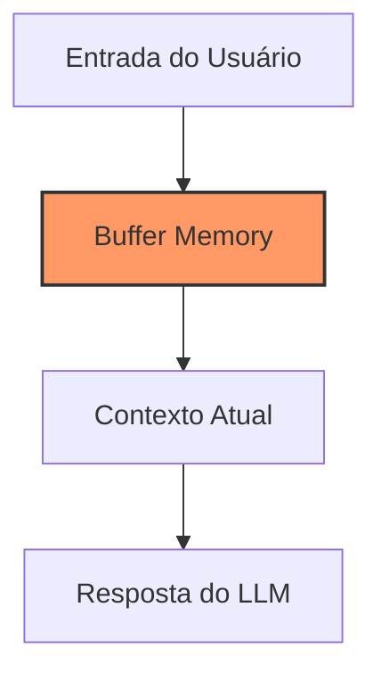
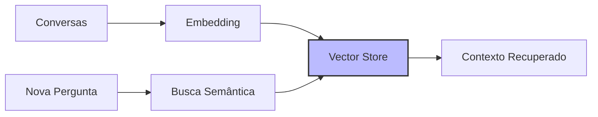
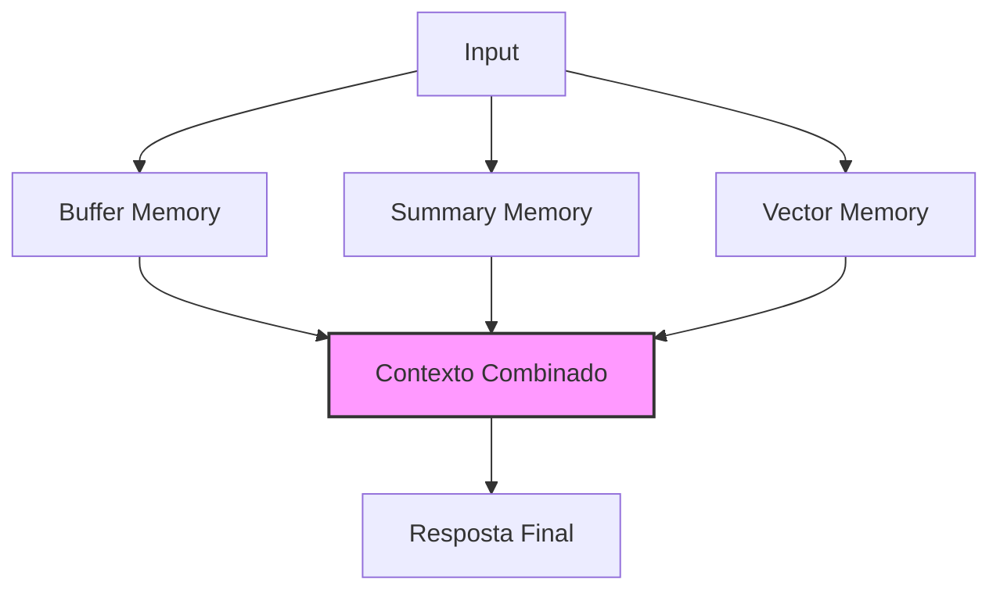

# Capítulo 4 - Memória no LangChain

## Introdução à Memória em LLMs

Você já se sentiu frustrado quando conversa com um chatbot que parece ter "amnésia" e esquece tudo o que você acabou de dizer? É como tentar explicar algo para alguém que limpa sua memória a cada 30 segundos - tipo o personagem Dory do filme "Procurando Nemo"! Bem, é exatamente esse problema que vamos resolver neste capítulo.

A memória no LangChain é como dar um "upgrade" no cérebro do seu assistente virtual, permitindo que ele mantenha um histórico das conversas e use essas informações para contextualizar suas respostas. É a diferença entre ter um assistente que realmente acompanha sua linha de raciocínio e um que precisa ser constantemente relembrado do assunto.

## Tipos de Memória no LangChain

### Memória de Curto Prazo (Buffer Memory)

A memória de curto prazo é como um bloco de notas onde o LLM guarda as informações mais recentes da conversa. É perfeita para manter o contexto imediato, mas tem um limite de capacidade - assim como nossa própria memória de trabalho.



### Memória de Longo Prazo (Vector Store Memory)

Imagine uma biblioteca onde você pode arquivar conversas importantes para referência futura. A memória de longo prazo usa bancos de dados vetoriais para armazenar e recuperar informações relevantes mesmo depois de muito tempo.



### Memória de Resumo (Summary Memory)

Esta é como ter um secretário muito eficiente que vai anotando os pontos principais da conversa e criando resumos concisos. Útil quando você precisa manter o contexto sem sobrecarregar o sistema.

## Implementando Memória no LangChain

Vamos ver como implementar diferentes tipos de memória em suas aplicações:

### Buffer Memory Básico

```python
from langchain.memory import ConversationBufferMemory
from langchain.chains import ConversationChain
from langchain.llms import OpenAI

# Criando uma memória simples
memory = ConversationBufferMemory()

# Inicializando uma chain com memória
conversation = ConversationChain(
    llm=OpenAI(),
    memory=memory,
    verbose=True
)

# Exemplo de uso
response = conversation.predict(input="Olá! Meu nome é Ana.")
print(response)

response = conversation.predict(input="Qual é meu nome?")
print(response)  # O modelo lembrará que seu nome é Ana
```

### Memória com Janela Deslizante

Para conversas longas, podemos usar uma janela deslizante que mantém apenas as últimas N interações:

```python
from langchain.memory import ConversationBufferWindowMemory

# Memória que mantém apenas as últimas 3 interações
window_memory = ConversationBufferWindowMemory(k=3)
```

## Estratégias Avançadas de Memória

### Memória Combinada

Às vezes, você precisa de diferentes tipos de memória trabalhando juntos. É como ter um assistente com um bloco de notas para anotações rápidas e um arquivo para informações importantes.



### Memória Seletiva

Nem tudo precisa ser lembrado. A memória seletiva permite filtrar e armazenar apenas informações relevantes:

```python
from langchain.memory import ConversationSummaryMemory

# Memória que mantém apenas um resumo das conversas
summary_memory = ConversationSummaryMemory(llm=OpenAI())
```

## Considerações de Hardware e Performance

### Requisitos de Memória RAM

O uso de memória no LangChain pode impactar significativamente os requisitos de hardware:

Para memória de buffer simples:
- Mínimo de 8GB de RAM para conversas curtas
- 16GB+ recomendado para históricos mais longos

Para Vector Store Memory:
- 16GB+ de RAM para bases pequenas
- 32GB+ para bases maiores
- GPU com 8GB+ VRAM se usar embeddings locais

### Otimização de Performance

A gestão eficiente da memória é crucial para manter seu sistema responsivo:

- Use janelas deslizantes para limitar o consumo de memória
- Implemente limpeza periódica de memória antiga
- Considere usar databases persistentes para históricos longos

## Armadilhas Comuns e Como Evitá-las

### Vazamento de Memória

Cuidado com o acúmulo infinito de histórico:

```python
# Boa prática: Limpar memória periodicamente
def limpar_memoria_antiga(memory, dias=30):
    """
    Remove entradas mais antigas que X dias
    """
    # Implementação da limpeza
    pass
```

### Sobrecarga de Contexto

Enviar muito contexto pode prejudicar a performance e qualidade das respostas:

```python
# Configure limites máximos
memory = ConversationBufferMemory(
    max_token_limit=2000,  # Limite de tokens
    return_messages=True
)
```

## Próximos Passos

No próximo capítulo, vamos explorar os Agents do LangChain, que podem usar esta memória para tomar decisões mais inteligentes e contextualmente relevantes.

## Recursos Adicionais

Documentação Oficial do LangChain sobre Memória
: https://python.langchain.com/docs/modules/memory/

Guia de Otimização de Memória
: https://python.langchain.com/docs/guides/memory/

Fórum da Comunidade sobre Casos de Uso de Memória
: https://github.com/langchain-ai/langchain/discussions/categories/memory

Tutorial Avançado sobre Vector Stores
: https://python.langchain.com/docs/modules/memory/vectorstore

Melhores Práticas para Gestão de Memória em Produção
: https://python.langchain.com/docs/guides/memory/best_practices