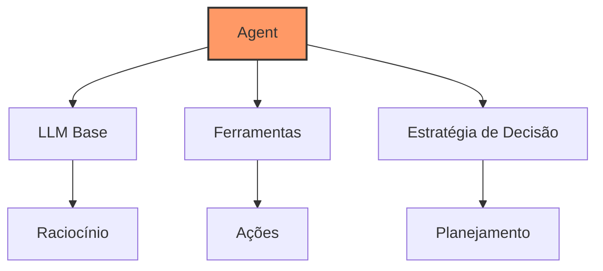
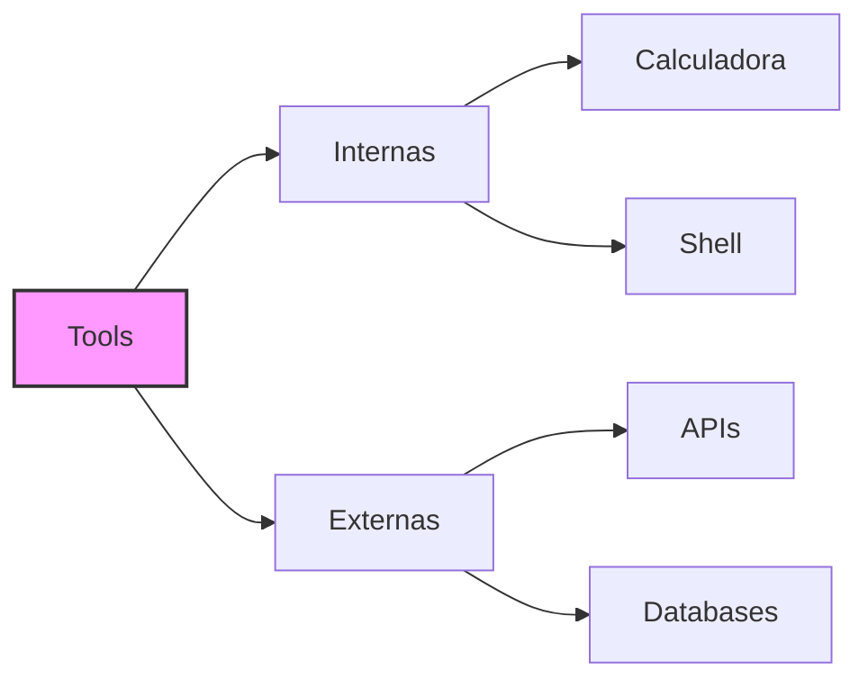

# Capítulo 5 - Agents no LangChain

## O Poder dos Agents

Após explorarmos a memória no capítulo anterior, chegou a hora de conhecer um dos recursos mais poderosos do LangChain: os Agents. Se até agora estávamos dando ao nosso LLM a capacidade de lembrar, agora vamos dar a ele o poder de agir!

Imagine um assistente que não apenas entende e responde suas perguntas, mas que também pode tomar decisões, usar ferramentas e executar ações no mundo real. É exatamente isso que os Agents fazem - eles são a ponte entre o poder de raciocínio dos LLMs e a capacidade de interagir com sistemas e dados externos.

## Anatomia de um Agent

Um Agent no LangChain é composto por três elementos principais:



1. **LLM Base**: O "cérebro" do agent, responsável pelo raciocínio e tomada de decisões
2. **Ferramentas**: As "mãos" do agent, que permitem interações com o mundo exterior
3. **Estratégia de Decisão**: O "processo de pensamento" que define como e quando usar cada ferramenta

## Tipos de Agents

O LangChain oferece diferentes tipos de agents, cada um com suas características únicas:

### Zero-Shot React Description

Este é o tipo mais versátil e comumente usado. O agent decide qual ferramenta usar baseado apenas na descrição das ferramentas disponíveis, sem necessidade de exemplos prévios.

```python
from langchain.agents import initialize_agent, Tool
from langchain.llms import OpenAI

# Configurando o LLM
llm = OpenAI(temperature=0)

# Definindo ferramentas
tools = [
    Tool(
        name="Calculadora",
        func=lambda x: eval(x),
        description="Útil para cálculos matemáticos simples"
    )
]

# Inicializando o agent
agent = initialize_agent(
    tools, 
    llm, 
    agent="zero-shot-react-description",
    verbose=True
)
```

### Conversational React

Especializado em manter conversas mais naturais e contextuais, este agent é perfeito para chatbots avançados:

```python
from langchain.memory import ConversationBufferMemory

# Configurando memória
memory = ConversationBufferMemory(memory_key="chat_history")

# Inicializando agent conversacional
agent = initialize_agent(
    tools,
    llm,
    agent="conversational-react-description",
    memory=memory,
    verbose=True
)
```

### Structured Chat

Ideal para interações que seguem um formato específico, como formulários ou consultas estruturadas:

```python
from langchain.agents import create_structured_chat_agent

# Definindo o schema da interação
agent = create_structured_chat_agent(
    llm,
    tools,
    system_message="Você é um assistente especializado em análise de dados agrícolas"
)
```

## Ferramentas (Tools)

As ferramentas são o que permitem que os agents interajam com o mundo exterior. Vamos explorar algumas das mais úteis:



### Criando Ferramentas Personalizadas

```python
from langchain.tools import BaseTool
from typing import Optional

class FerramentaAgil(BaseTool):
    name = "calculadora_agil"
    description = "Calcula métricas importantes para uma equipe ágil"

    def _run(self, query: str) -> str:
        # Implemente sua lógica aqui
        return "resultado do cálculo"

    def _arun(self, query: str) -> str:
        raise NotImplementedError("Versão assíncrona não implementada")
```

## Estratégias de Decisão

Os agents usam diferentes estratégias para decidir como e quando usar suas ferramentas:

### ReAct (Reasoning and Acting)

Este é o padrão mais comum, onde o agent:
1. Raciocina sobre a tarefa (Reasoning)
2. Escolhe uma ação (Acting)
3. Observa o resultado
4. Repete o processo até completar a tarefa

```python
# Exemplo de uso do ReAct
result = agent.run("""
    1. Calcule a previsão de trouhgput da equipe para os proximos 5 meses
    2. Considere a quantidade de entrega historica da equipe, por pessoa, nos ultimos 12 meses
    3. Somente para atividades de inovação
""")
```

## Hardware e Requisitos

### Recursos Necessários

Para rodar agents eficientemente, você precisa considerar:

**CPU**:
- Mínimo: 4 cores
- Recomendado: 8+ cores para processamento paralelo

**RAM**:
- Mínimo: 16GB
- Recomendado: 32GB+ para agents complexos

**GPU**:
- Para agents com modelos locais: RTX 3060 12GB ou superior
- Para agents na nuvem: Opcional, mas útil para processamento local

**Armazenamento**:
- SSD rápido para cache e armazenamento temporário
- Mínimo 256GB livres

## Otimização e Performance

### Cache de Resultados

```python
from langchain.cache import InMemoryCache
import langchain

# Configurando cache
langchain.cache = InMemoryCache()
```

### Controle de Tempo e Recursos

```python
# Configurando timeouts e limites
agent = initialize_agent(
    tools,
    llm,
    max_iterations=5,  # Evita loops infinitos
    timeout=30,        # Timeout em segundos
    max_tokens=2000    # Limite de tokens por chamada
)
```

## Casos de Uso

Vamos explorar alguns exemplos práticos:

### Assistente de Manejo

```python
# Definindo ferramentas específicas
tools = [
    Tool(
        name="entregas_historicas",
        func=consultar_fechamentos,
        description="Consulta quantidade de issues fechadas ao longo do tempo"
    ),
    Tool(
        name="entragas_por_dev",
        func=consultar_entrega_por_dev,
        description="Consulta dados de entrega por desenvolvedor"
    ),
    Tool(
        name="previsao",
        func=calcular_troughtput,
        description="Faz a previsão da quantidad de entregas possiveis para o futuro"
    )

]

# Inicializando agent especializado
agent_manejo = initialize_agent(
    tools,
    llm,
    agent="zero-shot-react-description",
    verbose=True
)
```

## Próximos Passos

No próximo capítulo, vamos explorar o LangSmith, uma ferramenta essencial para testar, depurar e otimizar nossos agents e fluxos do LangChain.

## Recursos Adicionais

Documentação Oficial de Agents
: https://python.langchain.com/docs/modules/agents/

Guia de Ferramentas do LangChain
: https://python.langchain.com/docs/modules/agents/tools/

Tutorial Avançado de Agents
: https://python.langchain.com/docs/guides/agents

Fórum da Comunidade sobre Agents
: https://github.com/langchain-ai/langchain/discussions/categories/agents

Exemplos Práticos de Agents
: https://python.langchain.com/docs/guides/agents/quick_start