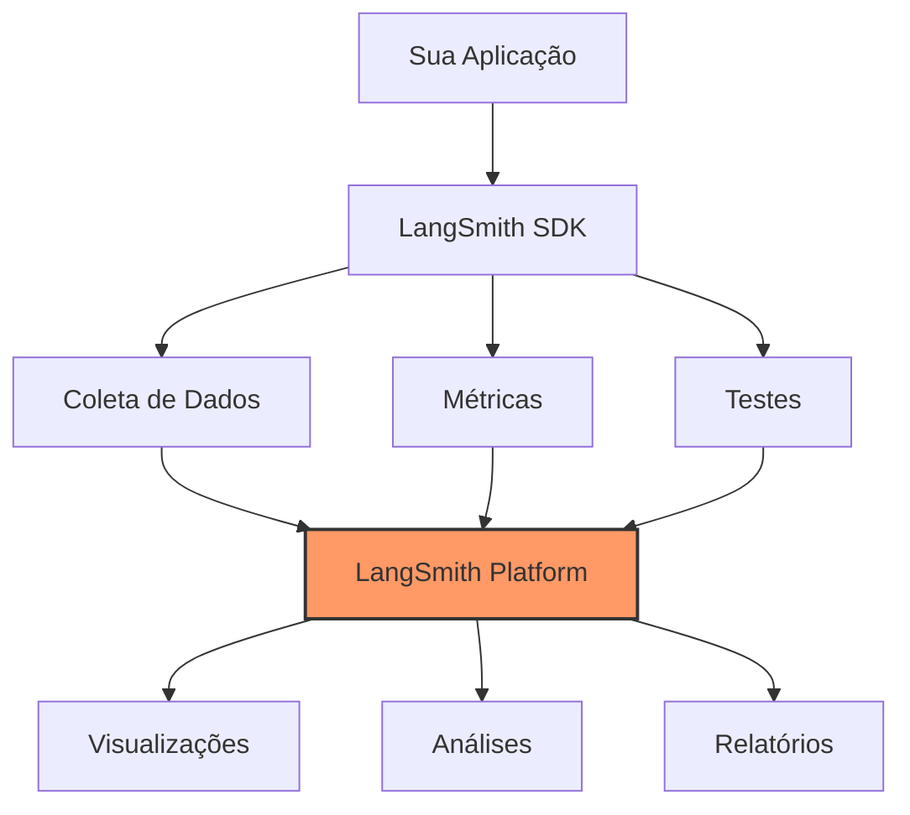
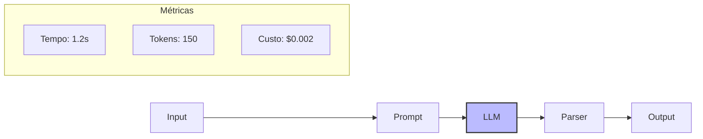

# Capítulo 6 - LangSmith: Testes e Depuração de LLMs

## Introdução ao LangSmith

Quando trabalhamos com sistemas baseados em LLMs, é comum nos perguntarmos: "Como sei se meu modelo está realmente funcionando bem?" ou "Por que meu agent tomou essa decisão específica?". O LangSmith é a resposta da Anthropic para essas perguntas - uma ferramenta especializada para testes, depuração e validação de aplicações baseadas em LangChain.

## Por que Precisamos do LangSmith?

O desenvolvimento de aplicações com LLMs apresenta desafios únicos:

- Os resultados podem ser imprevisíveis
- É difícil rastrear o processo de "pensamento" do modelo
- A avaliação de qualidade é subjetiva
- O debugging tradicional nem sempre é efetivo

O LangSmith resolve esses problemas oferecendo uma plataforma completa de observabilidade e testes.

## Arquitetura do LangSmith



## Configuração Inicial

Para começar a usar o LangSmith, você precisa configurar seu ambiente:

```python
from langsmith import Client
from langchain.callbacks import LangSmithCallback
import os

# Configurar credenciais
os.environ["LANGCHAIN_TRACING_V2"] = "true"
os.environ["LANGCHAIN_API_KEY"] = "sua_chave_aqui"

# Inicializar cliente
client = Client()

# Configurar callback
callback = LangSmithCallback(
    project_name="meu_projeto_pecuaria",
    client=client
)
```

## Monitorando Chains e Agents

### Tracejamento Básico

```python
from langchain.chains import LLMChain
from langchain.prompts import PromptTemplate

# Criar uma chain com monitoramento
chain = LLMChain(
    llm=llm,
    prompt=prompt,
    callbacks=[callback],
    tags=["producao", "analise_nutricional"]
)

# Executar com tracejamento
result = chain.run(
    input="Calcule a necessidade de proteína para 100 cabeças de gado Nelore"
)
```

### Métricas Importantes

O LangSmith coleta automaticamente várias métricas:

- Tempo de execução
- Uso de tokens
- Taxa de sucesso
- Latência
- Custos estimados

## Testes Automatizados

### Criando Datasets de Teste

```python
from langsmith import DatasetCreator

# Criar dataset
creator = DatasetCreator(
    client=client,
    name="testes_nutricao",
    description="Casos de teste para cálculos nutricionais"
)

# Adicionar exemplos
creator.add_example(
    inputs={"query": "Calcule ração para 100 cabeças"},
    outputs={"resultado_esperado": "1000kg de ração/dia"}
)
```

### Executando Testes

```python
from langchain.testing import TestChain

# Configurar testes
test_chain = TestChain(
    chain=chain,
    dataset=dataset,
    eval_llm=eval_llm
)

# Executar testes
results = test_chain.run_tests()
```

## Análise de Performance

### Visualização de Pipelines

O LangSmith oferece visualizações detalhadas do fluxo de execução:



### Métricas Avançadas

Para análises mais profundas, podemos criar métricas customizadas:

```python
def avaliar_precisao_nutricional(resultado, esperado):
    """
    Avalia a precisão dos cálculos nutricionais
    """
    from difflib import SequenceMatcher
    
    similarity = SequenceMatcher(None, resultado, esperado).ratio()
    return {
        "precisao": similarity,
        "confianca": similarity > 0.8
    }

# Registrar avaliador customizado
client.register_evaluator(
    "avaliador_nutricional",
    avaliar_precisao_nutricional
)
```

## Otimização e Debug

### Identificando Gargalos

O LangSmith ajuda a identificar onde seu pipeline está gastando mais tempo ou recursos:

```python
# Analisar performance
from langsmith.analytics import analyze_runs

analise = analyze_runs(
    client=client,
    project_name="meu_projeto_pecuaria",
    start_date="2024-01-01"
)

print(f"Tempo médio de execução: {analise.mean_duration}s")
print(f"Custo total estimado: ${analise.total_cost}")
```

### Debug Avançado

Para casos complexos, podemos usar o modo de debug detalhado:

```python
# Ativar debug detalhado
os.environ["LANGCHAIN_TRACING_V2_DEBUG"] = "true"

# Executar com log detalhado
with callback.trace("debug_nutricional") as trace:
    result = chain.run(input="Análise completa de dieta")
    trace.add_metadata({
        "complexidade": "alta",
        "tipo_analise": "dieta_completa"
    })
```

## Considerações de Hardware

Para um uso eficiente do LangSmith, considere:

- Servidor de logs com SSD rápido para tracejamento
- Mínimo de 16GB de RAM para análises complexas
- CPU multi-core para processamento paralelo de testes
- Rede estável para comunicação com a plataforma

## Melhores Práticas

1. Organização
   - Use tags consistentes para categorizar runs
   - Mantenha projetos separados por domínio
   - Documente todos os testes e métricas

2. Performance
   - Implemente caching para testes repetitivos
   - Use batch processing quando possível
   - Monitore uso de recursos regularmente

3. Segurança
   - Nunca exponha chaves de API
   - Sanitize dados sensíveis antes do tracejamento
   - Implemente controle de acesso adequado

## Próximos Passos

No próximo capítulo, exploraremos o LangGraph, que nos permitirá criar estruturas ainda mais complexas e inteligentes para nossas aplicações.

## Recursos Adicionais

Documentação Oficial do LangSmith
: https://docs.smith.langchain.com/

Guia de Métricas e Avaliação
: https://docs.smith.langchain.com/evaluation/

Fórum da Comunidade
: https://github.com/langchain-ai/langsmith/discussions

Tutorial Avançado de Testes
: https://python.langchain.com/docs/guides/evaluation/testing

Melhores Práticas de Monitoramento
: https://docs.smith.langchain.com/best-practices
