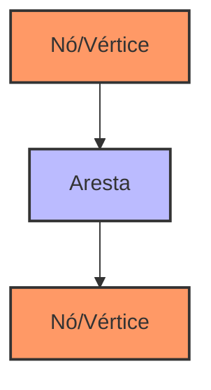
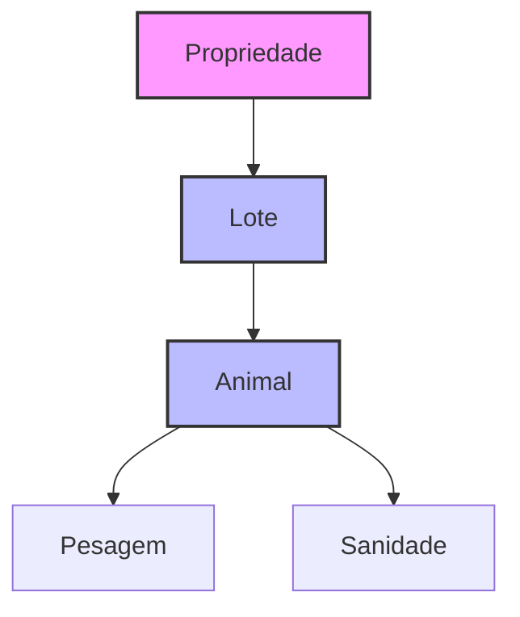

# Capítulo 7 - LangGraph: Modelagem de Conhecimento e Grafos Conceituais

## Introdução ao LangGraph

O LangGraph é uma extensão poderosa do ecossistema LangChain que nos permite modelar e manipular conhecimento em forma de grafos. Se você já trabalhou com bancos de dados relacionais, pense no LangGraph como uma forma mais flexível e intuitiva de representar relacionamentos complexos entre diferentes conceitos e entidades.

## Por que usar Grafos de Conhecimento?

No contexto do agronegócio, por exemplo, podemos ter um cenário onde precisamos representar:
- Relações entre diferentes raças de gado
- Ciclos de produção e suas etapas
- Cadeia de fornecedores e compradores
- Histórico sanitário do rebanho

Um grafo permite representar essas relações de forma natural e eficiente.

## Fundamentos de Grafos

Antes de mergulharmos no LangGraph, vamos entender os conceitos básicos de grafos:



### Componentes Básicos:
1. **Nós (Vértices)**: Representam entidades ou conceitos
2. **Arestas**: Representam relações entre os nós
3. **Propriedades**: Atributos que podem ser associados tanto a nós quanto a arestas

## Implementando LangGraph

Vamos começar com uma implementação básica:

```python
from langchain.graphs import NetworkxEntityGraph
from langchain.llms import OpenAI
import networkx as nx

# Inicializando o grafo
graph = NetworkxEntityGraph()

# Criando nós e relações
nodes_and_rels = {
    "nodes": [
        {"id": "boi_nelore", "type": "Raça", "properties": {"nome": "Nelore"}},
        {"id": "fase_cria", "type": "Fase", "properties": {"nome": "Cria"}},
        {"id": "peso_desmama", "type": "Indicador", "properties": {"valor": 180}}
    ],
    "relationships": [
        {
            "source": "boi_nelore",
            "target": "fase_cria",
            "type": "PARTICIPA_DE",
            "properties": {"período": "6-8 meses"}
        }
    ]
}

# Adicionando ao grafo
graph.add_nodes_and_rels_from_dict(nodes_and_rels)
```

## Consultas e Travessia de Grafos

Uma das principais vantagens do LangGraph é a capacidade de realizar consultas complexas:

```python
from langchain.graphs.query import GraphCypherQuery

# Definindo uma consulta
query = GraphCypherQuery(
    query="""
    MATCH (r:Raça)-[p:PARTICIPA_DE]->(f:Fase)
    WHERE r.nome = 'Nelore'
    RETURN r, p, f
    """
)

# Executando a consulta
results = graph.query(query)
```

## Integração com LLMs

O LangGraph brilha quando combinado com LLMs para gerar e atualizar conhecimento dinamicamente:

```python
from langchain.chains import GraphOperationChain

# Criando uma chain para análise de texto e extração de relações
chain = GraphOperationChain.from_llm(
    llm=OpenAI(temperature=0),
    graph=graph,
    verbose=True
)

# Extraindo relações de um texto
text = """
O Nelore é uma raça com excelente desempenho na fase de cria,
atingindo normalmente peso de desmama entre 170 e 190 kg.
"""

result = chain.run(text)
```

## Visualização de Grafos

Para visualizar nossos grafos, podemos usar diferentes ferramentas:

```python
import matplotlib.pyplot as plt

def visualize_graph(graph):
    plt.figure(figsize=(12, 8))
    pos = nx.spring_layout(graph.get_networkx_graph())
    nx.draw(
        graph.get_networkx_graph(),
        pos,
        with_labels=True,
        node_color='lightblue',
        node_size=1500,
        font_size=10,
        font_weight='bold'
    )
    plt.title("Grafo de Conhecimento do Agronegócio")
    plt.show()
```

## Padrões de Modelagem

### Modelagem de Domínio

Vamos ver como modelar um domínio específico do agronegócio:



Implementação correspondente:

```python
domain_model = {
    "nodes": [
        {"id": "propriedade_1", "type": "Propriedade", "properties": {"nome": "Fazenda São João"}},
        {"id": "lote_1", "type": "Lote", "properties": {"identificador": "L001"}},
        {"id": "animal_1", "type": "Animal", "properties": {"brinco": "A123"}}
    ],
    "relationships": [
        {"source": "propriedade_1", "target": "lote_1", "type": "POSSUI"},
        {"source": "lote_1", "target": "animal_1", "type": "CONTEM"}
    ]
}
```

## Otimização e Desempenho

### Gerenciamento de Memória

Para grafos grandes, é importante considerar o uso de memória:

```python
def optimize_graph(graph):
    # Removendo propriedades desnecessárias
    for node in graph.nodes():
        if 'temporary' in graph.nodes[node]:
            del graph.nodes[node]['temporary']
    
    # Compactando o grafo
    graph.remove_nodes_from(list(nx.isolates(graph)))
    return graph
```

### Índices e Consultas Eficientes

```python
# Criando índices para melhor desempenho
def create_indices(graph):
    # Índice por tipo de nó
    node_type_index = {}
    for node in graph.nodes():
        node_type = graph.nodes[node].get('type')
        if node_type not in node_type_index:
            node_type_index[node_type] = []
        node_type_index[node_type].append(node)
    
    return node_type_index
```

## Casos de Uso Avançados

### Rastreabilidade do Rebanho

```python
def criar_rastreabilidade(graph, animal_id):
    """
    Cria um subgrafo de rastreabilidade para um animal específico
    """
    query = f"""
    MATCH (a:Animal {{id: '{animal_id}'}})-[r*]-(n)
    RETURN a, r, n
    """
    return graph.query(GraphCypherQuery(query=query))
```

### Análise de Parentesco

```python
def analisar_parentesco(graph, animal_id):
    """
    Analisa relações de parentesco para melhoramento genético
    """
    query = f"""
    MATCH (a:Animal {{id: '{animal_id}'}})
    OPTIONAL MATCH (a)-[:FILHO_DE]->(p:Animal)
    OPTIONAL MATCH (a)<-[:FILHO_DE]-(f:Animal)
    RETURN a, p, f
    """
    return graph.query(GraphCypherQuery(query=query))
```

## Próximos Passos

No próximo capítulo, vamos explorar os fundamentos do RAG (Retrieval-Augmented Generation), que poderá ser combinado com nossos grafos de conhecimento para criar sistemas ainda mais poderosos.

## Recursos Adicionais

Documentação Oficial do LangGraph
: https://python.langchain.com/docs/langraph/

Tutorial de NetworkX
: https://networkx.org/documentation/stable/tutorial.html

Guia de Modelagem de Grafos
: https://neo4j.com/developer/guide-data-modeling/

Fórum da Comunidade LangChain
: https://github.com/langchain-ai/langchain/discussions
