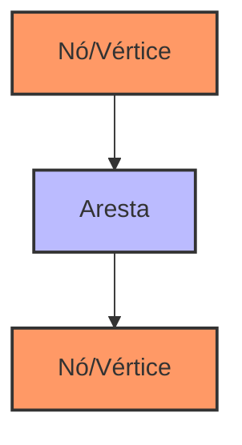
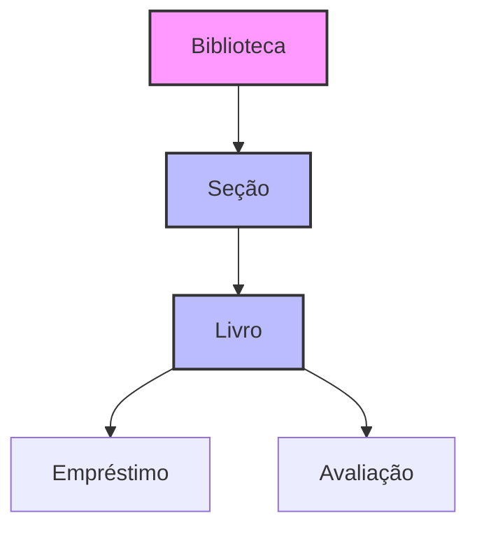

# Capítulo 7 - LangGraph: Modelagem de Conhecimento e Grafos Conceituais

## Introdução ao LangGraph

O LangGraph é uma extensão poderosa do ecossistema LangChain que nos permite modelar e manipular conhecimento em forma de grafos. Se você já trabalhou com bancos de dados relacionais, pense no LangGraph como uma forma mais flexível e intuitiva de representar relacionamentos complexos entre diferentes conceitos e entidades.

## Por que usar Grafos de Conhecimento?

No contexto de uma biblioteca digital, por exemplo, podemos ter um cenário onde precisamos representar:
- Relações entre diferentes gêneros literários
- Sequência de capítulos e suas dependências
- Rede de autores e colaboradores
- Histórico de empréstimos e devoluções

Um grafo permite representar essas relações de forma natural e eficiente.

## Fundamentos de Grafos

Antes de mergulharmos no LangGraph, vamos entender os conceitos básicos de grafos:



### Componentes Básicos:
1. **Nós (Vértices)**: Representam entidades ou conceitos
2. **Arestas**: Representam relações entre os nós
3. **Propriedades**: Atributos que podem ser associados tanto a nós quanto a arestas

## Implementando LangGraph

Vamos começar com uma implementação básica:

```python
from langchain.graphs import NetworkxEntityGraph
from langchain.llms import OpenAI
import networkx as nx

# Inicializando o grafo
graph = NetworkxEntityGraph()

# Criando nós e relações
nodes_and_rels = {
    "nodes": [
        {"id": "livro_hobbit", "type": "Livro", "properties": {"titulo": "O Hobbit"}},
        {"id": "fase_aventura", "type": "Genero", "properties": {"nome": "Aventura"}},
        {"id": "num_paginas", "type": "Indicador", "properties": {"valor": 336}}
    ],
    "relationships": [
        {
            "source": "livro_hobbit",
            "target": "fase_aventura",
            "type": "PERTENCE_A",
            "properties": {"subgenero": "Fantasia"}
        }
    ]
}

# Adicionando ao grafo
graph.add_nodes_and_rels_from_dict(nodes_and_rels)
```

## Consultas e Travessia de Grafos

Uma das principais vantagens do LangGraph é a capacidade de realizar consultas complexas:

```python
from langchain.graphs.query import GraphCypherQuery

# Definindo uma consulta
query = GraphCypherQuery(
    query="""
    MATCH (l:Livro)-[p:PERTENCE_A]->(g:Genero)
    WHERE l.titulo = 'O Hobbit'
    RETURN l, p, g
    """
)

# Executando a consulta
results = graph.query(query)
```

## Integração com LLMs

O LangGraph brilha quando combinado com LLMs para gerar e atualizar conhecimento dinamicamente:

```python
from langchain.chains import GraphOperationChain

# Criando uma chain para análise de texto e extração de relações
chain = GraphOperationChain.from_llm(
    llm=OpenAI(temperature=0),
    graph=graph,
    verbose=True
)

# Extraindo relações de um texto
text = """
O Hobbit é um livro do gênero aventura e fantasia,
contendo aproximadamente 336 páginas em sua primeira edição.
"""

result = chain.run(text)
```

## Visualização de Grafos

Para visualizar nossos grafos, podemos usar diferentes ferramentas:

```python
import matplotlib.pyplot as plt

def visualize_graph(graph):
    plt.figure(figsize=(12, 8))
    pos = nx.spring_layout(graph.get_networkx_graph())
    nx.draw(
        graph.get_networkx_graph(),
        pos,
        with_labels=True,
        node_color='lightblue',
        node_size=1500,
        font_size=10,
        font_weight='bold'
    )
    plt.title("Grafo de Conhecimento da Biblioteca")
    plt.show()
```

## Padrões de Modelagem

### Modelagem de Domínio

Vamos ver como modelar um domínio específico de uma biblioteca:



Implementação correspondente:

```python
domain_model = {
    "nodes": [
        {"id": "biblioteca_1", "type": "Biblioteca", "properties": {"nome": "Biblioteca Central"}},
        {"id": "secao_1", "type": "Seção", "properties": {"identificador": "S001"}},
        {"id": "livro_1", "type": "Livro", "properties": {"isbn": "123-456-789"}}
    ],
    "relationships": [
        {"source": "biblioteca_1", "target": "secao_1", "type": "POSSUI"},
        {"source": "secao_1", "target": "livro_1", "type": "CONTEM"}
    ]
}
```

## Otimização e Desempenho

### Gerenciamento de Memória

Para grafos grandes, é importante considerar o uso de memória:

```python
def optimize_graph(graph):
    # Removendo propriedades desnecessárias
    for node in graph.nodes():
        if 'temporary' in graph.nodes[node]:
            del graph.nodes[node]['temporary']
    
    # Compactando o grafo
    graph.remove_nodes_from(list(nx.isolates(graph)))
    return graph
```

### Índices e Consultas Eficientes

```python
# Criando índices para melhor desempenho
def create_indices(graph):
    # Índice por tipo de nó
    node_type_index = {}
    for node in graph.nodes():
        node_type = graph.nodes[node].get('type')
        if node_type not in node_type_index:
            node_type_index[node_type] = []
        node_type_index[node_type].append(node)
    
    return node_type_index
```

## Casos de Uso Avançados

### Rastreabilidade de Empréstimos

```python
def criar_rastreabilidade(graph, livro_id):
    """
    Cria um subgrafo de rastreabilidade para um livro específico
    """
    query = f"""
    MATCH (l:Livro {{id: '{livro_id}'}})-[r*]-(n)
    RETURN l, r, n
    """
    return graph.query(GraphCypherQuery(query=query))
```

### Análise de Autoria

```python
def analisar_autoria(graph, livro_id):
    """
    Analisa relações de autoria e co-autoria
    """
    query = f"""
    MATCH (l:Livro {{id: '{livro_id}'}})
    OPTIONAL MATCH (l)-[:ESCRITO_POR]->(a:Autor)
    OPTIONAL MATCH (a)-[:COLABOROU_COM]-(c:Autor)
    RETURN l, a, c
    """
    return graph.query(GraphCypherQuery(query=query))
```

## Próximos Passos

No próximo capítulo, vamos explorar os fundamentos do RAG (Retrieval-Augmented Generation), que poderá ser combinado com nossos grafos de conhecimento para criar sistemas ainda mais poderosos.

## Recursos Adicionais

Documentação Oficial do LangGraph
: https://python.langchain.com/docs/langraph/

Tutorial de NetworkX
: https://networkx.org/documentation/stable/tutorial.html

Guia de Modelagem de Grafos
: https://neo4j.com/developer/guide-data-modeling/

Fórum da Comunidade LangChain
: https://github.com/langchain-ai/langchain/discussions