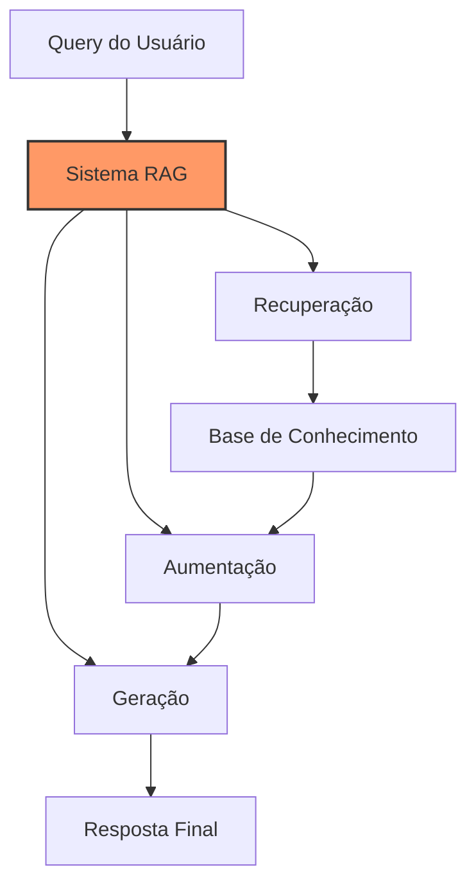
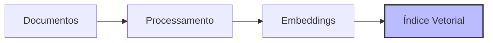

# Capítulo 8 - Fundamentos de RAG (Retrieval-Augmented Generation)

## Introdução ao RAG

Se você já tentou usar um LLM para responder perguntas sobre seus dados específicos - por exemplo, sobre seu rebanho ou histórico de produção - provavelmente percebeu que os modelos têm dificuldade em lidar com informações que não fazem parte de seu treinamento. É aí que entra o RAG (Retrieval-Augmented Generation), uma técnica poderosa que permite combinar a capacidade de geração dos LLMs com dados específicos do seu domínio.

## O que é RAG?

RAG é uma abordagem que "aumenta" a capacidade dos LLMs, permitindo que eles acessem e utilizem informações externas ao seu treinamento original. Imagine o RAG como um assistente muito inteligente que, antes de responder uma pergunta, consulta uma biblioteca personalizada de documentos relevantes.



## Arquitetura do RAG

O RAG é composto por três componentes principais:

### 1. Indexação (Indexing)

A indexação é o processo de preparar seus documentos para busca eficiente:



O processo envolve:
1. Quebrar documentos em chunks menores
2. Gerar embeddings para cada chunk
3. Armazenar em um banco de dados vetorial

### 2. Recuperação (Retrieval)

Quando uma pergunta é feita, o sistema:
1. Converte a pergunta em um embedding
2. Busca chunks similares na base de conhecimento
3. Recupera os mais relevantes

### 3. Geração (Generation)

O LLM recebe:
1. A pergunta original
2. Os chunks relevantes recuperados
3. Um prompt que o instrui a usar essas informações

## Implementação Básica

Vamos ver como implementar um sistema RAG simples:

```python
from langchain.document_loaders import DirectoryLoader
from langchain.text_splitter import RecursiveCharacterTextSplitter
from langchain.embeddings import OpenAIEmbeddings
from langchain.vectorstores import FAISS
from langchain.chains import RetrievalQA
from langchain.llms import OpenAI

# 1. Carregamento de Documentos
loader = DirectoryLoader('./documentos/', glob="**/*.txt")
documents = loader.load()

# 2. Divisão em Chunks
text_splitter = RecursiveCharacterTextSplitter(
    chunk_size=1000,
    chunk_overlap=200
)
chunks = text_splitter.split_documents(documents)

# 3. Criação de Embeddings e Índice
embeddings = OpenAIEmbeddings()
vectorstore = FAISS.from_documents(chunks, embeddings)

# 4. Configuração do RAG
qa_chain = RetrievalQA.from_chain_type(
    llm=OpenAI(),
    retriever=vectorstore.as_retriever(),
    chain_type="stuff"
)
```

## Considerações Importantes

### Chunking (Divisão de Documentos)

O tamanho ideal dos chunks depende do seu caso de uso:

```python
# Para documentos técnicos
text_splitter = RecursiveCharacterTextSplitter(
    chunk_size=1500,     # Chunks maiores para manter contexto
    chunk_overlap=300,   # Sobreposição para não perder informações
    separators=["\n\n", "\n", ".", " "] # Ordem de preferência para quebras
)

# Para dados tabulares ou registros curtos
text_splitter = RecursiveCharacterTextSplitter(
    chunk_size=500,      # Chunks menores para informações pontuais
    chunk_overlap=50,    # Menor sobreposição necessária
    separators=["\n", ",", " "] # Adaptado para dados estruturados
)
```

### Estratégias de Recuperação

Existem diferentes abordagens para recuperação:

1. **Similarity Search**: Busca por similaridade semântica
```python
retriever = vectorstore.as_retriever(
    search_type="similarity",
    search_kwargs={"k": 4}  # Número de chunks a recuperar
)
```

2. **MMR (Maximal Marginal Relevance)**: Balanceia relevância e diversidade
```python
retriever = vectorstore.as_retriever(
    search_type="mmr",
    search_kwargs={
        "k": 4,
        "fetch_k": 20,  # Candidatos iniciais
        "lambda_mult": 0.5  # Peso entre relevância e diversidade
    }
)
```

## Otimização de Performance

### Embeddings Eficientes

```python
# Cache de embeddings
from langchain.embeddings import CacheBackedEmbeddings
from langchain.storage import LocalFileStore

store = LocalFileStore("./cache/")
cached_embeddings = CacheBackedEmbeddings.from_bytes_store(
    underlying_embeddings=embeddings,
    document_embedding_cache=store,
)
```

### Filtragem de Metadados

```python
# Adicionando metadados aos documentos
for chunk in chunks:
    chunk.metadata = {
        "tipo": "manual_tecnico",
        "data": "2024-01",
        "categoria": "nutricao"
    }

# Recuperação com filtros
retriever = vectorstore.as_retriever(
    search_kwargs={
        "k": 4,
        "filter": {"categoria": "nutricao"}
    }
)
```

## Requisitos de Hardware

Para um sistema RAG eficiente, considere:

### CPU e Memória
- Mínimo: 16GB RAM, 4 cores
- Recomendado: 32GB RAM, 8+ cores
- Ideal: 64GB+ RAM para bases grandes

### Armazenamento
- SSD rápido para índices vetoriais
- Espaço proporcional ao tamanho da base
- Cache local para embeddings

### GPU
- Opcional para embeddings locais
- Recomendado: 8GB+ VRAM
- Modelos populares: RTX 3060 ou superior

## Monitoramento e Manutenção

### Métricas Importantes

```python
def avaliar_qualidade_rag(query, resposta, contexto_recuperado):
    metricas = {
        "num_chunks": len(contexto_recuperado),
        "tamanho_resposta": len(resposta),
        "tempo_recuperacao": tempo_recuperacao,
        "relevancia_contexto": score_relevancia
    }
    return metricas
```

### Atualização da Base

```python
def atualizar_base_conhecimento(novos_documentos):
    # Processar novos documentos
    novos_chunks = text_splitter.split_documents(novos_documentos)
    
    # Adicionar ao índice existente
    vectorstore.add_documents(novos_chunks)
    
    # Opcional: Compactar índice
    vectorstore.merge_index()
```

## Próximos Passos

No próximo capítulo, vamos aprofundar na implementação prática do RAG, explorando técnicas avançadas de recuperação e otimização para casos de uso específicos do agronegócio.

## Recursos Adicionais

Documentação do LangChain sobre RAG
: https://python.langchain.com/docs/use_cases/question_answering/

Tutorial de Vetorização e Busca
: https://python.langchain.com/docs/modules/data_connection/vectorstores/

Guia de Otimização de RAG
: https://python.langchain.com/docs/guides/evaluation/qa_generation

Fórum da Comunidade sobre RAG
: https://github.com/langchain-ai/langchain/discussions/categories/rag

Blog da Anthropic sobre RAG
: https://www.anthropic.com/blog/rag-best-practices
